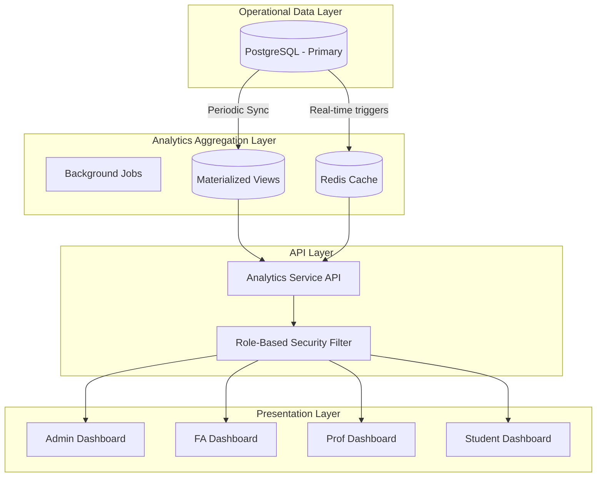

# CSE One - Volume 13
## Analytics & Business Intelligence Engine

### 1. Analytics Engine Overview
The Analytics & Business Intelligence (BI) Engine is the computational powerhouse of CSE One. Designed to process thousands of attendance and leave records generated daily, it transforms raw operational data into actionable, role-based insights. The engine strictly adheres to the data structures defined in Volumes 2, 7, 8, and 9, providing near real-time calculations without compromising the performance of the core transaction systems. It answers critical academic questions instantly—from a student's personal attendance health to department-wide operational efficiency.

### 2. Analytics Architecture
The architecture separates heavy read operations (analytics) from fast write operations (marking attendance).

### 3. KPI Definitions
All calculations treat `OD` (On Duty) mathematically equivalent to `Present` in the numerator, as per standard academic policy.

| KPI Name | Formula | Scope |
| :--- | :--- | :--- |
| **Overall Attendance %** | `((Present + OD) / Total Sessions) * 100` | Student, Section, Dept |
| **Subject Attendance %** | `((Present + OD) / Total Subject Sessions) * 100` | Student, Subject |
| **Attendance Completion Rate**| `(Sessions Submitted / Sessions Conducted) * 100` | Professor, Dept |
| **Modification Rate** | `(Sessions Modified / Total Sessions) * 100` | Professor, Dept |
| **FA Workload (Approval SLA)**| `Average(Approval Timestamp - Submission Timestamp)`| Faculty Advisor |

### 4. Role-Based Dashboards
The engine serves different aggregations based on the JWT role.

- **Student Dashboard:** Focuses on the individual. Shows Overall %, Subject-wise breakdown, and a GitHub-style 365-day attendance heatmap.
- **Professor Dashboard:** Focuses on delivery. Shows `Attendance Completion Rate` (did I forget to mark any classes?) and `Subject Distribution`.
- **Faculty Advisor Dashboard:** Focuses on cohort health. Shows a list of assigned students sorted ascending by Overall Attendance %, highlighting those below 75%.
- **Admin Dashboard:** Focuses on department health. Shows Section-wise comparisons, Professor Modification Trends, and massive aggregations.

### 5. Visualization Standards
Strict guidelines on how data is rendered using libraries like Recharts or Chart.js.
- **Line Charts:** Used ONLY for time-series data (e.g., Weekly Attendance Trend).
- **Bar Charts:** Used for categorical comparisons (e.g., Section A vs Section B).
- **Pie/Donut Charts:** Used strictly for composition (e.g., Present vs Absent vs OD breakdown of a single student).
- **KPI Cards:** Large typography for single numbers (Overall %), always paired with a smaller trend indicator (e.g., "↑ 2.1% from last month").
- **Heatmaps:** Used for daily density mapping (Student Calendar, Dept Calendar).

### 6. Attendance Health Engine
A deterministic, rule-based engine that evaluates a student's standing and provides actionable recovery metrics. Predictive analytics are explicitly excluded.

**Health Categories (Configurable Defaults):**
- **Excellent:** >= 85%
- **Good:** >= 75% and < 85%
- **Warning:** >= 65% and < 75%
- **Critical:** < 65%

**Recovery Calculation:**
If a student is at 72%, the engine calculates the deterministic formula:
`Required Classes = ((Target % * Total Conducted) - Current Attended) / (1 - Target %)`
*UI Output:* "You must attend the next 14 consecutive classes to reach 75%."

### 7. Data Aggregation Strategy
To prevent the dashboard API from executing `COUNT()` over 500,000 attendance records every time a user logs in, data is aggregated at rest.
- **Real-time (Cache):** Today's operational stats (Sessions Today, Pending Approvals) are calculated on the fly or cached in Redis.
- **Daily Aggregation:** A cron job runs at 00:01 every night to update `student_daily_summary` and `section_daily_summary` tables.
- **Materialized Views:** Used for complex Admin queries (e.g., month-over-month department trends) and refreshed via `REFRESH MATERIALIZED VIEW CONCURRENTLY` during off-peak hours.

### 8. API Specifications
- `GET /api/v1/analytics/student/{id}/overall`: Returns health category, overall %, and recovery metrics.
- `GET /api/v1/analytics/student/{id}/heatmap`: Returns an array of `{date, status}` for the last 365 days.
- `GET /api/v1/analytics/fa/cohort-health`: Returns an array of assigned students sorted by attendance percentage.
- `GET /api/v1/analytics/admin/section-comparison`: Returns aggregated percentages for Sections A-E.
- `GET /api/v1/analytics/admin/completion-rates`: Returns list of professors who have unmarked sessions.

### 9. Backend Service Design
- **AnalyticsEngine (Facade):** Routes incoming analytics requests to the appropriate sub-service based on the metric requested.
- **AggregationService:** Handles the cron jobs that summarize raw `attendance_record` data into the daily summary tables.
- **MetricsService:** Computes dynamic formulas on the fly (e.g., the Attendance Health Recovery calculation).
- **TrendAnalysisService:** Handles time-series queries, formatting data explicitly for Line/Bar chart consumption on the frontend.

### 10. Performance Strategy
- **Pre-Computation:** The heaviest lifting is done asynchronously at night. The API primarily acts as a fast reader of pre-computed summary tables.
- **Indexed Queries:** Any real-time queries explicitly utilize covering indexes on `(student_id, session_id)` or `(faculty_advisor_id, status)`.
- **Pagination:** FA and Admin lists of students are strictly paginated.

### 11. Security Strategy
- **Strict Row-Level Isolation:**
  - The `student_id` parameter in the API is checked against the JWT `sub`. If a student requests another student's ID, `403 Forbidden` is returned.
  - An FA requesting `/cohort-health` only receives students explicitly linked to them in the `student` table.
- **No Direct SQL Execution:** The API never accepts arbitrary SQL or complex filter objects that could lead to injection; filters are strictly typed via Pydantic.

### 12. Audit Strategy
While read operations are generally not audited to save space, the following analytics events are logged:
- `LARGE_DATA_EXPORT`: An Admin downloading the CSV of the entire department's attendance.
- `REPORT_GENERATED`: Whenever a formal PDF report is requested from the Analytics Engine.

### 13. Testing Strategy
- **Analytics Validation Tests:** The most critical test suite. Creates a mock database with exactly 100 sessions (80 Present, 15 Absent, 5 OD) and asserts that the API mathematically returns `85.00%`.
- **Health Engine Tests:** Asserts that the "Required Classes to 75%" formula returns the correct mathematical integer for edge cases (e.g., what if they are already above 75%).
- **Performance Tests:** Asserts that the Admin Dashboard API returns within 200ms when querying a database populated with 1 million mock attendance records.

### 14. Analytics Engine Architecture Decision Record (ADR)
- **ADR-BI-001: Daily Aggregation over Real-Time Global Calculation:** Chosen because cumulative attendance (e.g., a student's percentage over 6 months) changes only once a day. Calculating it from raw records on every page load wastes CPU. 
- **ADR-BI-002: Deterministic Recovery Metric over AI Prediction:** Chosen because academic standing is a strict mathematical policy. Telling a student "You have a 60% chance of failing" is less helpful than "You must attend exactly 14 classes to pass."
- **ADR-BI-003: OD = Present in Numerator:** Explicitly documented as an architectural rule to ensure that all future frontend graphs or backend calculations never penalize students for officially sanctioned On Duty activities.
