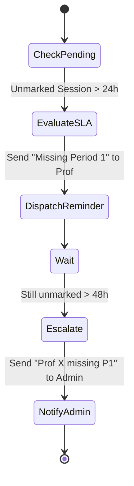

# CSE One - Volume 15
## Notification & Communication Engine

### 1. Notification Engine Overview
The Notification & Communication Engine is a centralized, event-driven subsystem that orchestrates all messaging across the CSE One platform. It acts as the nervous system connecting the distinct modules (Attendance, Leaves, Timetable, Reporting) with the users (Students, Professors, Admins). By decoupling the generation of an event from its delivery, this engine guarantees scalability, intelligent routing, and role-based filtering, ensuring that users receive timely, relevant information without being overwhelmed by noise.

### 2. Event-Driven Architecture
The architecture relies on a publisher-subscriber (Pub/Sub) model. Domains emit raw business events, and the Notification Engine dictates *if*, *how*, and *when* they are delivered.

```mermaid
graph TD
    subgraph Event Publishers (Domains)
        Att[Attendance Engine]
        Leave[Leave Engine]
        Time[Timetable Engine]
        Admin[Admin Portal]
    end

    subgraph Message Broker
        Kafka[(Event Bus / Redis PubSub)]
    end

    subgraph Notification Engine
        Listener[Event Listener Service]
        Router[Delivery Router]
        Pref[Preference Engine]
        Retry[Retry/DLQ Worker]
    end

    subgraph Delivery Channels
        InApp[PWA In-App DB]
        Push[Web Push / FCM]
        Email[Email SMTP - Future]
    end

    Att -->|ATTENDANCE_MODIFIED| Kafka
    Leave -->|LEAVE_APPROVED| Kafka
    Time -->|SUBSTITUTE_ASSIGNED| Kafka
    Admin -->|GLOBAL_ANNOUNCEMENT| Kafka

    Kafka --> Listener
    Listener --> Router
    Router --> Pref
    Pref --> InApp
    Pref --> Push
    Router -.Failed.-> Retry
```

### 3. Notification Types & Priority
Every event maps to a distinct Notification Type and is assigned a strict Priority which dictates delivery urgency.

- **Critical:** Bypasses user "Do Not Disturb" preferences. (e.g., `Security Alert`, `Timetable Changed Today`).
- **High:** Requires immediate attention. (e.g., `Substitute Assigned`, `Leave Rejected`, `Attendance Below 75%`).
- **Medium:** Standard operational flow. (e.g., `Leave Approved`, `Report Ready`).
- **Low:** Informational. (e.g., `General Announcement`, `Semester Start`).

### 4. Role-Based Delivery
The engine guarantees that a user only receives notifications contextually relevant to their explicit roles.
- **Student:** Receives updates on their own attendance modifications, leave status changes, and global announcements.
- **Professor:** Receives substitute assignments, reminders for unmarked periods, and department notices.
- **Faculty Advisor:** Receives "New Leave Request from {Student}" and "Student {X} attendance dropped below 75%" alerts.
- **Admin:** Receives aggregated daily summaries (e.g., "12 sessions left unmarked today") and system health alerts.

### 5. Announcement Management
A specialized sub-module within the engine allowing Admins to broadcast manual messages.
- **Targeting:** Send to `ALL`, `ROLE=STUDENT`, `ROLE=PROFESSOR`, `SECTION=A`, or `YEAR=III`.
- **Scheduling:** Create an announcement today, but schedule delivery for Monday at 08:00 AM.
- **Persistence:** Announcements appear pinned at the top of the Notification Center until explicitly dismissed or their expiry date is reached.

### 6. Reminder Engine
An automated daemon that sweeps the database to find pending tasks and nudges the responsible party.


### 7. Notification Center
The frontend inbox accessible via the bell icon in all portals (Volumes 10, 11, 12).
- **Features:** Infinite scrolling inbox, Unread Count Badge, "Mark all as read", "Archive".
- **Visuals:** Uses standard shadcn/ui Toast components for ephemeral alerts, and structured cards for the inbox. Icons differentiate types (e.g., Calendar for Timetable, Checkmark for Attendance).

### 8. API Specifications
- `GET /api/v1/notifications`: Paginated list of the user's notifications.
- `GET /api/v1/notifications/unread-count`: Returns `{ count: 5 }`.
- `PUT /api/v1/notifications/{id}/read`: Marks a single item as read.
- `PUT /api/v1/notifications/read-all`: Clears the unread badge.
- `POST /api/v1/notifications/announcements`: Admin-only route to broadcast a message.
- `DELETE /api/v1/notifications/{id}`: Soft-deletes a notification from the user's view.

### 9. Backend Service Design
- **EventListenerService:** Subscribes to the internal event bus. Formats raw events (e.g., `LEAVE_ID_123_APPROVED`) into human-readable payloads (e.g., "Your leave for Monday has been approved.").
- **DeliveryService:** Determines *how* to send the message (WebSocket for real-time online users, DB insert for offline users, Web Push if subscribed).
- **AnnouncementService:** Manages the CRUD and scheduled dispatch of Admin broadcasts.
- **ReminderService:** A cron-driven service that evaluates SLA breaches (pending leaves, unmarked attendance).

### 10. Frontend Specifications
- **Real-Time Integration:** Leverages Server-Sent Events (SSE) or WebSockets to instantly update the bell icon without polling.
- **Responsive Drawer:** On desktop, clicking the bell opens a right-side drawer. On mobile, it navigates to a dedicated full-screen `/notifications` route.
- **Empty States:** A friendly illustration ("You're all caught up!") when the inbox is empty.

### 11. Business Rules
- **Idempotency:** The engine must prevent duplicate dispatch if the event bus double-fires (using unique `event_id` hashes).
- **No Hard Deletes:** Deleting a notification merely flips `is_deleted = true` for the user, preserving the audit trail of delivery.
- **Immutability:** Once an automated notification or announcement is dispatched to a user's inbox, its content cannot be altered.

### 12. Security Strategy
- **Event Integrity:** Internal events must be signed or originate from a trusted internal VPC network to prevent spoofing.
- **Data Leakage Prevention:** The payload of a notification must never contain raw PII that the receiving user is not authorized to see (enforced by the Role Validator).

### 13. Audit Logging
Every action taken by the Notification Engine is recorded in the central `audit_log`.
- **Log Payload:** `ACTION: NOTIFICATION_DISPATCHED`, `RECIPIENT: {User_ID}`, `TYPE: LEAVE_APPROVED`, `CHANNEL: IN_APP`.
- **Why:** Invaluable for resolving disputes (e.g., a Professor claiming they were never notified they were assigned as a substitute).

### 14. Performance Strategy
- **Asynchronous Processing:** Event ingestion to delivery happens asynchronously via background workers (e.g., Celery/Redis Queue) so the primary API never blocks while sending messages.
- **Batch Processing:** The Delivery Service batches database inserts (e.g., broadcasting to 500 students) using `INSERT INTO ... VALUES (...)` in chunks of 1000.
- **TTL (Time to Live):** Low-priority notifications auto-archive after 30 days to keep the active `notifications` table small.

### 15. Testing Strategy
- **Event Flow Tests:** Fire a mock `ATTENDANCE_MODIFIED` event onto the bus and assert that a notification appears in the target student's inbox.
- **Retry Tests:** Simulate a database lock failure during delivery and assert that the Dead Letter Queue (DLQ) correctly retries the delivery 3 times before failing.
- **Load Tests:** Simulate an Admin broadcasting to all 5,000 users simultaneously to ensure the batch insertion completes in under 2 seconds.

### 16. Notification Engine Architecture Decision Record (ADR)
- **ADR-NOT-001: Pub/Sub Decoupling:** Chosen over direct service calls. The LeaveService does not care *how* a student is notified; it merely publishes `LEAVE_APPROVED`. This prevents tightly coupled, spaghetti code between modules.
- **ADR-NOT-002: In-App Database First:** Chosen as the primary delivery channel. While Emails and Web Push are future-ready abstractions, guaranteeing delivery in the PWA database ensures 100% reliability for academic compliance.
- **ADR-NOT-003: Soft Deletes for Inbox:** Chosen because academic disputes frequently involve claims of "I wasn't told." Preserving the record of delivery and read-status permanently resolves these issues.
