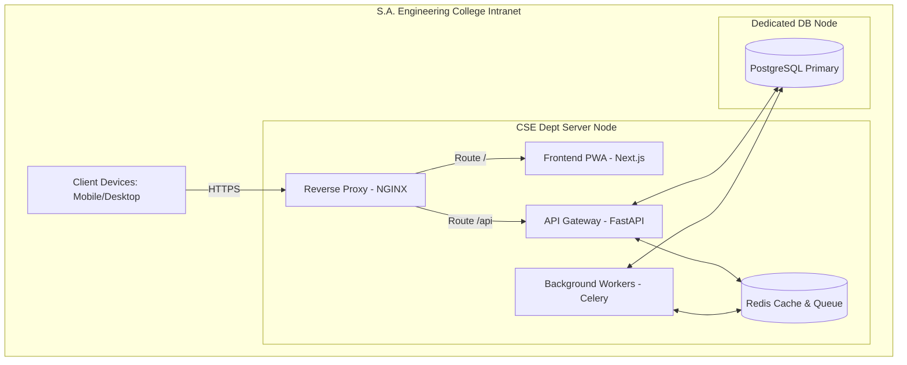
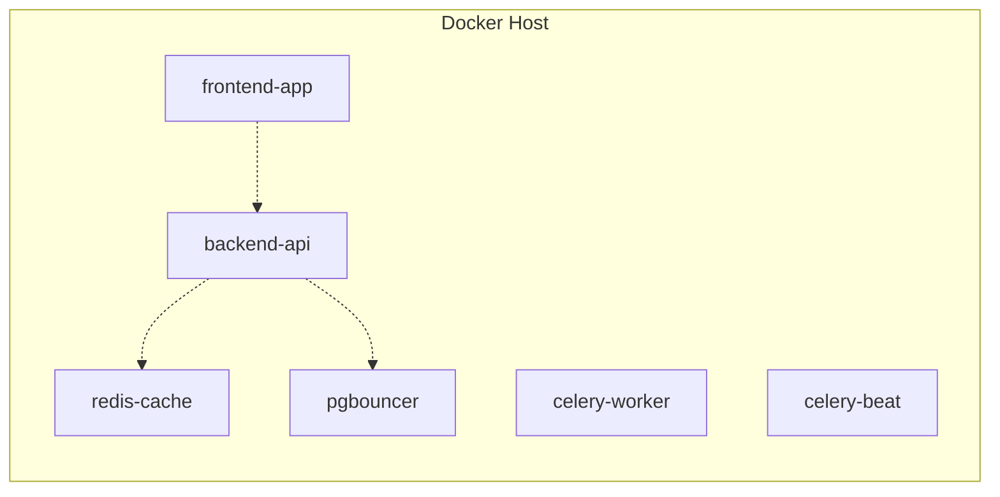

# CSE One - Volume 16
## Infrastructure, DevOps & Production Deployment

### 1. Infrastructure Overview
The CSE One infrastructure is designed with a "Local First, Cloud Ready" philosophy. Initially deployed on S.A. Engineering College's on-premises intranet to serve the Department of Computer Science and Engineering, the architecture leverages containerization and reverse proxying to achieve enterprise-grade reliability. This ensures zero latency for on-campus users while maintaining a strict security posture. The infrastructure is fully modular, allowing seamless migration to a hybrid or pure cloud environment as institutional adoption scales.

### 2. Deployment Architecture
The system is deployed as a cluster of interconnected containers running on a dedicated departmental server.

### 3. Network Architecture
- **Server Network (VLAN 10):** Contains the primary Application Server and Database Server. Isolated from general internet access; bound by strict firewall rules.
- **Administrative Network (VLAN 20):** Faculty and HOD desktops. Has direct routing to the CSE One IP.
- **Computer Labs & Wi-Fi (VLAN 30/40):** Student access networks.
- **Internal DNS:** `cseone.saec.local` mapped to the NGINX Reverse Proxy IP.
- **SSL/TLS:** Internal Certificate Authority (CA) provisions SSL certificates to ensure HTTPS across the intranet, satisfying the PWA service worker requirement.

### 4. Application Deployment
- **Frontend (PWA):** Built as a static export or optimized Next.js standalone server, served behind NGINX.
- **Backend API:** Managed by Uvicorn/Gunicorn, running multiple worker processes to handle concurrent student logins during peak morning hours.
- **Background Workers:** Dedicated containers handling Report Generation (Volume 14) and Notification Dispatch (Volume 15) to prevent API blocking.

### 5. Database Deployment
- **Engine:** PostgreSQL 16 (preferred over SQL Server due to container native performance and cost).
- **Storage:** Data directory mounted to a high-IOPS RAID 10 SSD array.
- **Connection Pooling:** PgBouncer deployed between the API and PostgreSQL to handle thousands of rapid, short-lived connections when students open the app simultaneously.
- **Archiving:** Historical attendance records older than 4 years are moved to a cold-storage schema.

### 6. Docker & Container Strategy
The entire stack is defined declaratively using `docker-compose.yml`.

- **Base Images:** Alpine Linux or distroless images to minimize attack surface.
- **Restart Policies:** `restart: unless-stopped` on all critical containers.

### 7. CI/CD Pipeline
Designed to run on GitLab CI (or equivalent self-hosted runner).
1. **Code Commit:** Developer pushes to `main`.
2. **Static Analysis:** Flake8 (Python) and ESLint (JS/TS) run.
3. **Unit Tests:** PyTest and Jest execute core logic validations.
4. **Container Build:** `docker build` constructs immutable images tagged with the Git SHA.
5. **Security Scan:** Trivy scans the Docker image for CVEs.
6. **Deployment:** Runner executes SSH command to the production server: `docker-compose pull && docker-compose up -d`.
7. **Smoke Tests:** Automated ping to `/api/health` to verify successful boot.

### 8. Configuration Management
- **Environment Profiles:** 
  - `development.env` (Local laptop)
  - `staging.env` (Pre-prod testing server)
  - `production.env` (Live server)
- **Secrets Management:** Passwords (DB, JWT Secrets) are injected via `.env` files which are securely stored on the host server and injected at runtime. They are strictly `.gitignore`d.

### 9. Logging Strategy
- **Centralized Aggregation:** Containers output logs to `stdout/stderr`. Docker's logging driver ships these to a central ELK stack (Elasticsearch, Logstash, Kibana) or lightweight alternative (Promtail/Loki).
- **Format:** JSON formatted logs containing `timestamp`, `level`, `trace_id`, and `module` (e.g., `AttendanceEngine`).
- **Retention:** Application logs kept for 30 days. Immutable `audit_log` database table kept indefinitely.

### 10. Monitoring Strategy
- **Metrics Collection:** Prometheus scrapes `/metrics` endpoints exposed by FastAPI, Redis, and PostgreSQL.
- **Dashboards:** Grafana visualizing:
  - API Latency (p95, p99).
  - Database CPU & Memory.
  - Active WebSocket connections.
  - Celery Queue Length (Notification backlog).
- **Alerting:** Alertmanager triggers an email to the IT Admin if API Error Rate > 2% or DB CPU > 85%.

### 11. Backup & Disaster Recovery
- **Daily Backups:** `pg_dump` runs at 02:00 AM via a cron job, generating a compressed SQL archive.
- **Off-Site Sync:** The archive is securely copied (scp/rsync) to a physically separate NAS in another campus building.
- **Point-in-Time Recovery:** WAL (Write-Ahead Logging) archiving enabled for sub-hour recovery.
- **Disaster Recovery Workflow:**
  1. Provision new server.
  2. Install Docker.
  3. Pull images from registry.
  4. Restore latest `pg_dump`.
  5. Update Internal DNS.

### 12. Security Strategy
- **Network Boundaries:** Default DROP firewall policy. Only ports 80/443 exposed to the intranet. Database port 5432 bound ONLY to the internal Docker network.
- **Secure Headers:** NGINX injects `Strict-Transport-Security`, `X-Content-Type-Options`, and `Content-Security-Policy`.
- **Rate Limiting:** NGINX restricts login endpoint requests to prevent brute force attacks.
- **Encryption at Rest:** Underlying host OS utilizes LUKS disk encryption to protect database files in case of physical server theft.

### 13. Performance Strategy
- **Caching Layer:** Redis caches heavy Admin Dashboard analytical queries (Volume 13) with a 15-minute TTL.
- **Static Assets:** NGINX configured with `gzip/brotli` compression and heavy `Cache-Control` headers for all PWA JS/CSS bundles.
- **Gunicorn Tuning:** Workers optimized based on server core count `(2 * CPU) + 1` for synchronous endpoints.

### 14. Scalability Roadmap
1. **Current:** Single-node Docker Compose on Intranet.
2. **Phase 2 (Multi-Department):** Migration to Docker Swarm or lightweight K3s cluster. Separation of DB to a dedicated hardware node.
3. **Phase 3 (Hybrid Cloud):** PWA static assets moved to AWS CloudFront/S3. Backend API remains on-prem, exposed via secure AWS Site-to-Site VPN.

### 15. Maintenance Procedures
- **Software Updates:** Scheduled for Saturday 10:00 PM. Update Docker images, run Alembic DB migrations.
- **Log Rotation:** Docker daemon configured with `max-size: 50m` and `max-file: 3` to prevent disk exhaustion.
- **Certificate Renewal:** Automated internal script running ACME protocol or manual IT replacement 30 days prior to expiry.

### 16. Testing Strategy
- **Infrastructure Tests:** Automated scripts validating firewall rules (e.g., verifying port 5432 is unreachable from a student laptop).
- **Backup Restore Testing:** Mandatory bi-annual drill: IT team restores the production backup to a staging server to verify data integrity and document recovery time (RTO).
- **Load Testing:** Locust scripts simulating 500 professors submitting attendance simultaneously at 08:45 AM.

### 17. Operational Runbook
- **Incident: "Database Unreachable"** -> Check Docker status, check storage space (`df -h`), review PostgreSQL logs.
- **Incident: "High API Latency"** -> Check Grafana. Is CPU pegged? Are connection pools exhausted? Restart API containers to clear stuck workers.
- **Incident: "Reports not generating"** -> Check Celery worker logs. Restart Redis broker.

### 18. Infrastructure Architecture Decision Record (ADR)
- **ADR-INF-001: Containerization over Bare Metal:** Chosen to eliminate "it works on my machine" issues. Docker ensures the environment tested in staging is identical to production. It drastically reduces RTO during disaster recovery.
- **ADR-INF-002: Intranet Deployment:** Chosen for Phase 1 to guarantee absolute data sovereignty, eliminate cloud hosting costs, and ensure zero-latency operation during college hours regardless of external ISP outages.
- **ADR-INF-003: NGINX Reverse Proxy:** Chosen over direct API exposure. NGINX efficiently handles SSL termination, static file serving, and rate limiting, freeing the Python backend to focus solely on business logic.
