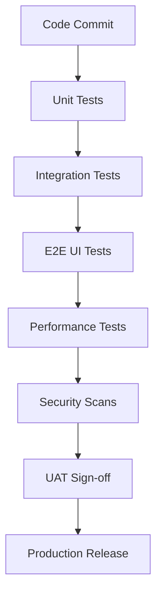

# CSE One - Volume 17
## Enterprise Quality Assurance, Security, Documentation & Go-Live Readiness

### 1. Production Readiness Overview
Volume 17 represents the culmination of the CSE One architectural design phase. It synthesizes Volumes 1 through 16 into a definitive Go-Live protocol. This specification ensures that before a single student or professor accesses the platform, CSE One has been rigorously tested, secured, documented, and operationally hardened. It transitions the project from a theoretical architecture into a living, production-ready enterprise system serving S.A. Engineering College.

### 2. Quality Assurance Strategy
A multi-layered testing pyramid guarantees platform stability.
- **Unit Testing:** Validates isolated functions (e.g., Attendance Health Math in Vol 13). *Exit Criteria: 85% Code Coverage.*
- **Integration Testing:** Validates boundaries between services (e.g., Leave Engine talking to Notification Engine).
- **End-to-End (E2E) Testing:** Automated Cypress scripts validating critical user journeys (e.g., Student Login -> Apply Leave -> FA Approves -> Professor sees OD).
- **API Testing:** Postman/Newman collections asserting correct HTTP status codes and JSON schemas.
- **Cross-Device Testing:** Validation on 1080p desktop, iPad Pro (Tablet), and iPhone SE (Mobile/PWA).

### 3. Security Assessment Plan
Aligning with OWASP Top 10 principles to protect institutional data.
- **Authentication/Authorization:** Validation of Argon2id hashing, short-lived JWTs, HttpOnly cookies, and strict RBAC enforcement (Vols 6 & 12).
- **XSS & CSRF:** Verification of React/Next.js auto-escaping and anti-CSRF token implementation on state-mutating endpoints.
- **SQL Injection:** Verification that Prisma/SQLAlchemy ORMs are utilized exclusively, with zero string-concatenated SQL queries.
- **Rate Limiting:** NGINX thresholds tested against brute-force login attempts.
- **Audit Integrity:** Validation that the `audit_log` table cannot be altered or deleted via the application API.

### 4. Performance Validation
Expected baselines under normal Intranet load (approx. 500 concurrent morning users):
- **API Response Time:** < 200ms for 95th percentile requests.
- **Dashboard Load Time (TTI):** < 1.5 seconds on college Wi-Fi.
- **Database Connection Pooling:** PgBouncer successfully queues and resolves 1000 concurrent connection requests without dropping transactions.
- **Report Generation:** Heavy PDF generation (Vol 14) executes asynchronously within 5 seconds without blocking the main API thread.

### 5. Release Management
- **Environments:** `Development` (Local) -> `Staging` (Intranet Clone) -> `Production` (Live).
- **Versioning:** Semantic Versioning (`v1.0.0`).
- **Release Workflow:** Code frozen on Thursday -> Deployed to Staging Friday -> UAT Sign-off Monday -> Production Deployment Tuesday 10:00 PM (Maintenance Window).
- **Rollback Strategy:** Blue/Green deployment using Docker tags. If `v1.1.0` fails post-launch, NGINX is immediately routed back to `v1.0.0` container instances.

### 6. Documentation Suite
The following artifacts must be written and approved prior to Go-Live:
- **System Architecture Guide:** Distillation of Volumes 1-17.
- **API Documentation:** Swagger/OpenAPI spec accessible at `/docs`.
- **Database Schema:** Entity-Relationship (ER) diagram poster.
- **User Manuals:** Distinct 2-page graphical PDFs for Students, Professors, Faculty Advisors, and Admins.
- **Operations Handbook:** IT team guide for starting, stopping, and backing up the system.

### 7. User Acceptance Testing (UAT)
Conducted by a select pilot group from the CSE Department.
- **Student Scenario:** "Apply for a 2-day medical leave and verify it appears in your history."
- **Professor Scenario:** "Open the portal at 08:30 AM and mark Period 1 attendance for III Year Sec A."
- **FA Scenario:** "Approve the student's medical leave and verify their attendance percentage updates."
- **Sign-off:** The HOD of CSE must formally sign the UAT completion certificate before Go-Live.

### 8. Production Readiness Checklists
**Infrastructure Checklist:**
- [ ] Production Server provisioned with static IP.
- [ ] RAID 10 SSD storage verified.
- [ ] Internal DNS (`cseone.saec.local`) resolving.
- [ ] SSL Certificates installed on NGINX.

**Application Checklist:**
- [ ] JWT Secrets rotated from staging defaults.
- [ ] Database credentials rotated.
- [ ] Daily backup cron job enabled.
- [ ] Default Admin password changed.

### 9. Risk Management
- **Risk:** Intranet network failure.
  - *Mitigation:* PWA Service Worker serves offline dashboard; Attendance marked offline syncs upon reconnection.
- **Risk:** Low User Adoption by Senior Faculty.
  - *Mitigation:* Department mandate by HOD, supported by 1-on-1 training sessions and extreme UX simplicity (Vol 11).
- **Risk:** Database Corruption.
  - *Mitigation:* Point-in-time recovery enabled; daily off-site backups verified weekly.

### 10. Operations Handbook
- **System Startup:** `systemctl start docker && docker-compose up -d`.
- **Log Management:** Logs auto-rotate at 50MB. Admin uses Portainer or Kibana to view live logs.
- **Database Maintenance:** `VACUUM ANALYZE` scheduled weekly to maintain PostgreSQL query performance.

### 11. Training & Change Management
- **Phase 1 (Admins & FAs):** Intensive 2-hour workshop focusing on student assignment, timetable creation, and leave overrides.
- **Phase 2 (Professors):** 30-minute demonstration during a faculty meeting focusing purely on the "Start Attendance" workflow.
- **Phase 3 (Students):** An introductory PDF emailed to college accounts and a 5-minute briefing by their FA.

### 12. Monitoring & Support
- **Health Monitoring:** Prometheus/Grafana stack alerting on High CPU, Memory Leaks, or API 500 Errors.
- **Support Workflow:** Users report issues via a dedicated IT Helpdesk email (`cseone-support@saec.ac.in`).
- **SLAs:** Critical bugs (Cannot mark attendance) resolved within 2 hours. Low priority (UI typo) resolved in next sprint.

### 13. Post Go-Live Support (Hypercare)
- **Duration:** 14 Days post-launch.
- **Protocol:** Development team is on standby during morning attendance hours (08:00 AM - 10:00 AM) to hotfix any edge cases instantly. No new features are merged during Hypercare.

### 14. API Governance
- **Versioning:** API routes explicitly prefixed with `/api/v1/`.
- **Deprecation:** A route must return a `Deprecation` header for 3 months before being removed in `/api/v2/`.
- **Documentation:** All endpoints require strict Pydantic schemas validating input/output.

### 15. Compliance Considerations
- **Data Privacy:** CSE One stores biometric references (photos) and personal academic records. Access is strictly audited.
- **Record Retention:** Attendance and Leave data is immutable and archived for 4 years to comply with university graduation auditing standards.

### 16. Final Architecture Validation
Volumes 1–17 represent a cohesive, enterprise-grade system.
- **Data (Vol 2) & Logic (Vol 3)** power the engines (Vols 7, 8, 9).
- **Security (Vol 6)** protects the interfaces (Vols 10, 11, 12).
- **Insights (Vol 13) & Documents (Vol 14)** provide business intelligence.
- **Events (Vol 15)** connect the modules.
- **Infrastructure (Vol 16)** hosts the system reliably.
- **Readiness (Vol 17)** ensures it can be safely handed over to the institution.

### 17. Production Readiness Architecture Decision Record (ADR)
- **ADR-PR-001: Departmental UAT Sign-off:** Chosen to ensure shared responsibility. The system does not go live until the Department HOD agrees the software accurately reflects their operational reality.
- **ADR-PR-002: Hypercare Period:** Chosen because academic systems face intense load spikes at specific times (e.g., 08:30 AM). Developer standby during these hours mitigates the highest risk of systemic failure.
- **ADR-PR-003: Immutable Audit Ledger Finality:** Chosen to ensure compliance. Under no circumstances can the QA, Admin, or Dev team delete a production audit log, ensuring absolute transparency.
