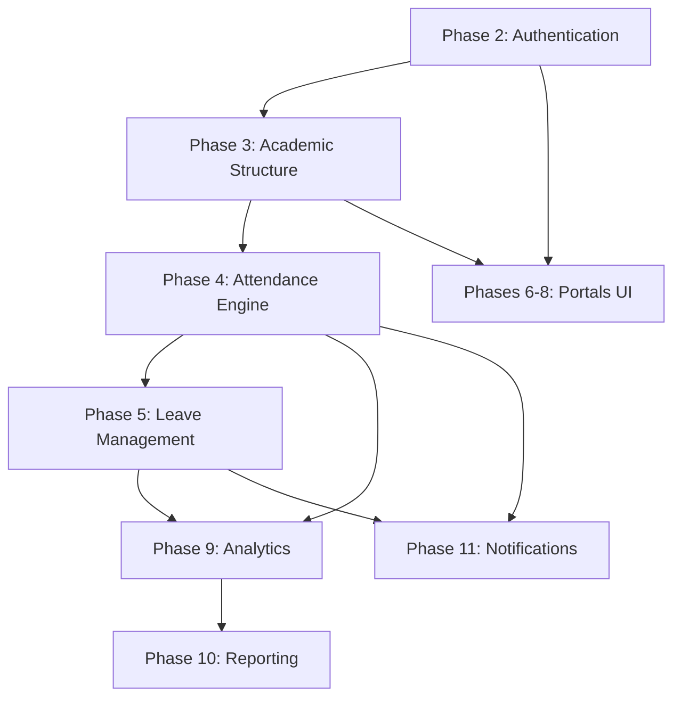
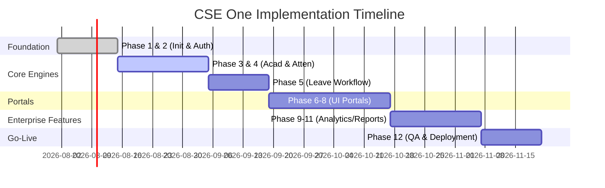

# CSE One - Volume 18
## Enterprise Implementation Blueprint & Development Roadmap

### 1. Development Overview
Volume 18 serves as the Master Development Blueprint for CSE One. It translates the architectural vision established in Volumes 1 through 17 into an executable, Agile-driven engineering roadmap. This document defines the exact sequence of implementation, the governance models guiding the engineering team, and the rigorous quality gates that must be cleared to transition CSE One from design to a production-ready enterprise system serving S.A. Engineering College.

### 2. Implementation Phases
To manage complexity, development is strictly ordered to satisfy architectural dependencies.

- **Phase 1:** Project Initialization (Repo, CI/CD, DB Init, Coding Standards).
- **Phase 2:** Authentication & Identity Management (RBAC, JWT).
- **Phase 3:** Academic Structure & Timetable Engine (Core domains).
- **Phase 4:** Attendance Engine (APIs & Validation).
- **Phase 5:** Leave Management (FA Workflows).
- **Phase 6:** Student Portal (PWA UI).
- **Phase 7:** Academic Staff Portal (Professor & FA UI).
- **Phase 8:** Admin Portal (System Management UI).
- **Phase 9:** Analytics Engine (Dashboards & KPIs).
- **Phase 10:** Reporting Engine (PDF/Excel generation).
- **Phase 11:** Notification Engine (Events & Dispatch).
- **Phase 12:** Infrastructure, Deployment, Testing, Go-Live.

### 3. Sprint Roadmap
Development follows 2-week Agile Sprints.

**Sprint 1: Foundation & Auth**
- *Goal:* Establish the Monorepo, CI pipeline, and core security.
- *Deliverables:* Working API `/auth/login`, DB Migrations for `users`.
- *Dependencies:* None.
- *Definition of Done (DoD):* 85% coverage, CI green, PR merged.

**Sprint 2: Academic Core & Timetable**
- *Goal:* Build the foundation of the college structure.
- *Deliverables:* APIs for Subjects, Sections, Timetable slots.
- *Dependencies:* Sprint 1 (Auth).

**Sprint 3: Attendance Engine (Backend)**
- *Goal:* Implement the core business logic for marking attendance.
- *Deliverables:* `/attendance/sessions` APIs, Audit Logs.
- *Dependencies:* Sprint 2.

*(Sprints continue sequentially through the phases...)*

### 4. Repository Strategy
- **Structure:** Monorepo using Turborepo or NPM workspaces.
  - `apps/frontend` (Next.js PWA)
  - `apps/backend` (FastAPI Python)
  - `packages/shared-types`
- **Branching:** GitFlow (or GitHub Flow).
  - `main` (Production, highly protected).
  - `staging` (UAT environment).
  - `feature/TICKET-123-description` (Active development).
- **Pull Requests:** Require 2 approving reviews, passing CI (tests + linting), and no merge conflicts.

### 5. Coding Standards
Strict adherence to industry standards is enforced via automated linting.
- **Frontend (React/TypeScript):** 
  - Strict mode enabled. No `any` types.
  - ESLint + Prettier.
  - Feature-Sliced Design (FSD) architecture.
- **Backend (FastAPI/Python):** 
  - *Correction from generic specs to match Vol 3:* Python 3.11+, strict type hinting.
  - Ruff for linting, Black for formatting.
  - SQLAlchemy 2.0 paradigms.
- **Database:** `snake_case` for all tables and columns.
- **Error Handling:** Standardized JSON error format: `{ "error": "CODE", "message": "Human readable" }`.

### 6. Module Dependency Diagram

### 7. Development Workflow
1. **Ticket Creation:** Jira/Linear ticket created with AC (Acceptance Criteria).
2. **Branching:** Dev creates `feature/ticket-id`.
3. **Implementation:** Code + Unit Tests written locally.
4. **Code Review:** PR opened against `staging`. CI runs static analysis.
5. **QA Validation:** Deployed to ephemeral preview environment. QA tests AC.
6. **Merge:** Code merged to `staging`.

### 8. Database Migration Strategy
- **Tool:** Alembic (Python/SQLAlchemy).
- **Versioning:** Linear, immutable migration scripts (e.g., `001_create_users.py`).
- **Seed Data:** Dedicated seed scripts for Development (fake data) vs Production (default Admin account, college departments).
- **Safety:** Migrations must be reversible (`down` methods required).

### 9. API Implementation Plan
- **Phase 2 (Auth):** `/api/v1/auth/*` (High Priority).
- **Phase 3 (Academic):** `/api/v1/departments/*`, `/api/v1/timetable/*` (High Priority, depends on Auth).
- **Phase 4 (Attendance):** `/api/v1/attendance/*` (Critical Priority, depends on Academic).
- *All APIs require Swagger/OpenAPI documentation auto-generated via FastAPI.*

### 10. UI Implementation Plan
1. **Design System:** Implement shadcn/ui components, define Tailwind color variables (College Blue).
2. **Admin Portal:** Built first to allow insertion of mock data (Students, Profs, Timetables).
3. **Academic Staff Portal:** Built second, integrating with the Timetable and Attendance APIs.
4. **Student PWA:** Built last, heavily consuming the Analytics and Notification endpoints.

### 11. Testing Roadmap
- **Continuous:** Unit Tests (Jest for JS, PyTest for Python) run on every commit.
- **Post-Merge:** API Integration tests run against a spun-up PostgreSQL Docker container.
- **Pre-Release:** Cypress E2E tests run against the Staging environment. E2E focuses on the "Happy Path" (Login -> Mark Attendance -> View Report).
- **Pre-Go-Live:** Dedicated Load Testing (Locust) and Security Scans (Trivy).

### 12. Deployment Roadmap
1. **Dev Deployment:** Local `docker-compose.yml` for instant feedback.
2. **Staging Deployment:** Push to `staging` branch triggers CI/CD to deploy to a restricted College Intranet server.
3. **Pilot Rollout:** Soft launch to the CSE Department (Phase 1).
4. **Production Rollout:** Full launch.
5. **Rollback:** In case of critical failure, revert Docker image tag to previous stable build.

### 13. Governance Model
- **Product Owner:** Defines priorities and signs off on tickets.
- **Tech Lead:** Enforces coding standards and approves architectural deviations.
- **QA Lead:** Owns the Staging environment and signs off on releases.
- **Ceremonies:** Daily Standup (15m), Weekly Backlog Refinement, Bi-weekly Sprint Review & Retrospective.

### 14. Deliverables Matrix
| Phase | Source Code | Documentation | Artifacts |
| :--- | :--- | :--- | :--- |
| **Phase 1-3** | Core Repos | Architecture README | DB Schema |
| **Phase 4-5** | Core Engines | API Docs (Swagger) | Test Coverage Reports |
| **Phase 6-8** | Frontend Code | UX component library | PWA built assets |
| **Phase 9-11**| Async Workers | Reporting Templates | Notification schemas |
| **Phase 12** | Infra Config | Operations Runbook | Docker Images |

### 15. Milestone Timeline

### 16. Enterprise Implementation Architecture Decision Record (ADR)
- **ADR-IMP-001: Backend-First Development:** Chosen over UI-first. The complex rules of the Attendance and Timetable engines must be solidified via APIs and Integration Tests before frontend consumption begins, preventing UI churn.
- **ADR-IMP-002: Admin Portal First (UI):** Chosen because the system requires robust structural data (Professors, Subjects, Timetables) to function. Building the Admin UI first eliminates the need for developers to manually write complex database seed scripts for testing the Professor and Student portals.
- **ADR-IMP-003: Monorepo Strategy:** Chosen to share TypeScript interfaces between the frontend and any Node.js microservices, and to maintain the entire project state in a single Git commit hash for simplified versioning.
