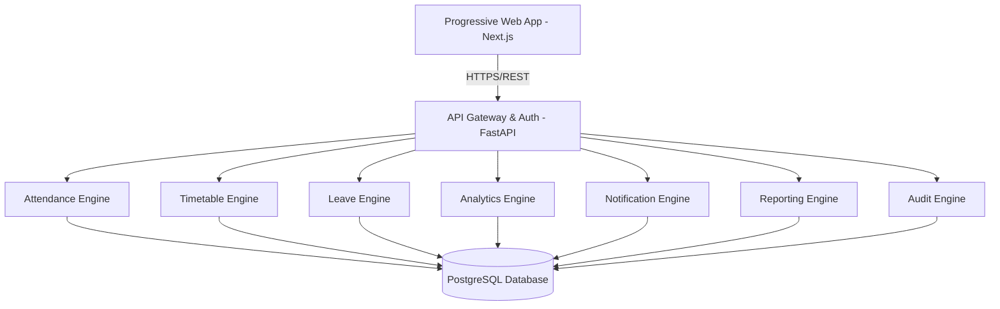

# CSE One - Master Architecture Specification
## Volume 1 – Product Vision, System Architecture & Foundation

### 1. Executive Summary
CSE One is a production-grade, Intelligent Attendance and Academic Operations Platform custom-built exclusively for the Department of Computer Science and Engineering at S.A. Engineering College. Operating under the banner "One Department. One Platform.", this Progressive Web Application (PWA) fundamentally revolutionizes how academic attendance, leave management, and administrative tracking are conducted. Starting with a 6-month pilot deployment within the college intranet, this architecture sets an extensible foundation allowing for eventual external deployment and native mobile packaging, all without a single structural redesign.

### 2. Product Vision
To establish a singular, authoritative, and frictionless digital ecosystem for the Computer Science and Engineering department. CSE One will eliminate redundant paperwork and disjointed academic tracking by digitizing the core functions of student attendance, leave approvals, and schedule management into a highly refined, premium, and unified digital experience.

### 3. Product Objectives
- **Digitization & Automation:** fully automate daily attendance capture and processing.
- **Role-Centric Operations:** provide distinct, secure workflows for Students, Professors, Faculty Advisors, and Administrators.
- **Timetable Integration:** bind attendance dynamically to scheduled classes.
- **Zero Extraneous Features:** enforce a strict scope avoiding broad ERP features (e.g., finance, library, hostel).
- **Scalable Foundation:** build a system capable of seamless transition from an intranet pilot to a globally accessible mobile/web application.

### 4. Business Goals
- **Operational Efficiency:** reduce administrative overhead related to attendance tracking by over 80%.
- **Data Integrity & Transparency:** provide real-time attendance analytics and leave status to all stakeholders.
- **Rapid Adoption:** achieve near 100% usage within the department through an intuitive and frictionless UI.
- **Pilot Success:** demonstrate impeccable reliability during the initial 6-month intranet deployment to secure institutional approval for broader deployment.

### 5. User Personas
- **Student:** Needs real-time visibility into their attendance percentages, leave history, and an easy way to submit leave requests.
- **Professor:** Needs a frictionless interface to log in, view the current class based on the timetable, and swiftly mark attendance (Present/Absent/OD) with optional reasons for absences.
- **Faculty Advisor:** Manages a cohort of ~20 students. Needs analytics, low attendance alerts, and workflows to approve or reject student leave requests.
- **Administrator:** The root authority. Manages structural configurations including academic years, sections, subjects, timetables, and professor accounts. Needs top-level audit logs and department analytics.

### 6. Functional Requirements
- **Authentication & Authorization:** Secure, role-based login for all user types.
- **Administrative Configuration:** Creation of Professor accounts, subjects, academic sections, timetables, and Faculty Advisor mapping.
- **Timetable Engine:** Automatic resolution of the current class for a logged-in Professor.
- **Attendance Management:** Marking, modifying, and previewing attendance. Support for Present, Absent (with reason/prior leave mapping), and On Duty (OD).
- **Leave Management:** Student leave request submission, Faculty Advisor approval/rejection workflow, and automated attendance record updates.
- **Analytics & Reporting:** Dashboards with real-time percentage calculations, low-attendance alerts, and department-wide reporting.
- **Notifications:** Alerts for leave status changes, low attendance, and system events.

### 7. Non-Functional Requirements
- **Performance:** Sub-second response times for core workflows (attendance capture).
- **Security:** Strict enforcement of JWT, RBAC, input validation, and protection against OWASP top 10 vulnerabilities (SQLi, XSS, CSRF).
- **Usability:** Premium, responsive, accessibility-compliant interface (PWA) matching modern enterprise standards.
- **Maintainability:** Strict adherence to Clean Architecture, SOLID principles, and DRY.
- **Deployability:** Containerized via Docker for reliable deployment on Ubuntu/NGINX within the intranet.

### 8. Complete System Workflow
1. **Setup:** Administrator configures the academic structure (Years, Sections), Subjects, Timetable, and Professor accounts. Administrator assigns Faculty Advisors.
2. **Student Onboarding:** Faculty Advisor creates and manages Student accounts.
3. **Daily Operations:** 
   - Professor logs in; the dashboard auto-detects the ongoing class via the Timetable Engine.
   - Professor initiates the Attendance Session, marking students as Present, Absent, or OD.
   - For absent students, prior leave requests are cross-referenced or reasons are manually specified.
4. **Data Sync:** Attendance data is committed to the database, instantly updating Analytics for Students, Faculty Advisors, and the Department.
5. **Leave Processing:** Students request leaves; Faculty Advisors approve/reject. Approved leaves automatically reflect in the Attendance/Leave History.

### 9. User Journey
- **Administrator:** Logs in -> Configures base data -> Uploads timetable -> Monitors department health via reports.
- **Faculty Advisor:** Logs in -> Views assigned cohort -> Reviews alerts (low attendance) -> Approves/Rejects pending leaves.
- **Professor:** Logs in -> Lands on "Today's Timetable" -> Clicks active class -> Marks attendance -> Saves and views preview/history.
- **Student:** Logs in -> Lands on Dashboard -> Views Attendance Percentage & Calendar -> Checks leave history -> Submits new leave request if needed.

### 10. Information Architecture
- **Global Navigation:** Dashboard, Profile, Notifications, Logout.
- **Student View:** Attendance Analytics, Calendar, Leave Requests, History.
- **Professor View:** Today's Classes, Attendance History, Analytics.
- **Faculty Advisor View:** My Students, Leave Approvals, Cohort Analytics.
- **Administrator View:** Master Data Management, User Management, Timetable Configuration, Audit Logs.

### 11. High-Level System Architecture


### 12. Application Architecture
- **Frontend Layer:** Built with Next.js 15 (React 19) functioning as a Progressive Web Application. Utilizes React Hook Form and Zod for validation, TanStack Query for state/data fetching.
- **API Layer:** FastAPI exposing RESTful endpoints. Contains JWT-based authentication guards and request validation via Pydantic.
- **Business Logic Layer:** Python services implementing business rules (e.g., leave approval logic, timetable resolution), strictly decoupled from HTTP concerns.
- **Data Access Layer:** SQLAlchemy ORM utilizing the Repository Pattern to interact with the database. Alembic for migrations.
- **Database Layer:** PostgreSQL handling relational data ensuring ACID compliance.

### 13. Module Architecture
- **Auth Module:** Login, Password Hashing (Argon2), JWT generation/validation.
- **Core Admin Module:** Academic Structure, Subject Management, Account Provisioning.
- **Timetable Module:** Schedule CRUD, current-class resolution logic.
- **Attendance Module:** Session management, marking logic, modification tracking.
- **Leave Module:** Request lifecycle (Draft -> Submitted -> Approved/Rejected).
- **Analytics Module:** Aggregation queries for attendance percentages and cohort health.
- **Audit & Notification Module:** Action logging, system alerts.

### 14. UI/UX Philosophy
- **Institutional Yet Premium:** Inspired by S.A. Engineering College's official branding but elevated to a state-of-the-art enterprise aesthetic.
- **Minimal & Elegant:** Whitespace-heavy, highly readable, avoiding visual clutter. No gaming UI, neon colors, or excessive glassmorphism.
- **Professional & Fast:** Immediate visual feedback, subtle micro-interactions using Framer Motion, and high responsiveness.
- **Academic Context:** Data presentation (tables, calendars, charts) is designed for professional clarity and rapid comprehension.

### 15. Design System
- **Colors:**
  - Primary: Institutional Navy Blue
  - Secondary: Royal Blue
  - Background: White
  - Surface: Light Gray
  - Semantic: Green (Success/Present), Red (Danger/Absent), Amber (Warning/OD/Leave)
- **Typography:** Inter (Primary), Poppins (Fallback). Large, readable scaling.
- **Components:** Built using Tailwind CSS and shadcn/ui. 8px grid spacing, clean rounded cards, minimal soft shadows, consistent Lucide React iconography.

### 16. Navigation Structure
- **Sidebar (Desktop) / Bottom Nav (Mobile):** Context-aware based on role.
- **Top Bar:** User Profile, Notification Bell, Breadcrumbs for deep navigation.
- **Context Menus:** Clean dropdowns for row-level actions in tables.

### 17. Technology Stack
**Frontend:**
- Framework: Next.js 15, React 19, TypeScript
- Styling: Tailwind CSS, shadcn/ui
- Animation: Framer Motion
- Data Fetching: TanStack Query
- Forms & Validation: React Hook Form, Zod
- Icons & Charts: Lucide React, Recharts
- Platform: Progressive Web App (PWA)

**Backend:**
- Framework: FastAPI, Python, Uvicorn
- Data/ORM: SQLAlchemy, Alembic, Pydantic
- Security: JWT, Argon2

**Database:**
- Primary: PostgreSQL (Architected to support SQL Server if dictated in production)

**Deployment:**
- Infrastructure: Ubuntu Server, NGINX, Docker, HTTPS Ready

### 18. Security Architecture
- **Authentication:** Stateless JWTs with secure, HttpOnly cookies for web clients.
- **Authorization:** Granular Role-Based Access Control (RBAC) enforced at API endpoints and UI rendering.
- **Data Protection:** Argon2 for password hashing. All API communication over HTTPS.
- **Vulnerability Mitigation:** FastAPI provides native JSON validation (protecting against injection). ORM prevents SQL injection. strict CORS and CSRF configurations.
- **Auditability:** Dedicated Audit Engine logging every administrative and attendance-altering action with timestamp and user ID.

### 19. Deployment Strategy
- **Phase 1 (Pilot):** Containerized deployment using Docker Compose on an on-premise Ubuntu Server within the college intranet.
- **Web Server:** NGINX acts as a reverse proxy, handling SSL termination and static asset serving (if required).
- **CI/CD:** Automated builds pushing Docker images, allowing for pull-based updates on the target server.

### 20. Scalability Strategy
- **Stateless Backend:** FastAPI services are completely stateless, allowing horizontal scaling via multiple Uvicorn worker processes.
- **Database Optimization:** Strategic indexing on query-heavy columns (e.g., Attendance dates, User roles, Timetable slots).
- **Caching:** Future-proofing architectural hooks exist to introduce Redis if query loads increase exponentially (though Postgres should suffice for a single department).
- **Client-Side:** Next.js static generation and efficient client-side caching via TanStack Query minimize server roundtrips.

### 21. Coding Standards
- **Architecture:** Clean Architecture and Service Repository Pattern.
- **Principles:** STRICT adherence to SOLID principles. Dependency Injection for all services. No duplicated logic (DRY).
- **Quality:** No placeholders, no mock implementations shipped, no TODO comments in the master branch. Production-ready code only.
- **Typing:** Strict TypeScript typing on the frontend; strict Python type hinting on the backend.

### 22. Project Folder Strategy (High-Level)
```text
CSE_One/
├── frontend/                 # Next.js 15 PWA
│   ├── src/
│   │   ├── app/              # App Router pages
│   │   ├── components/       # Reusable UI (shadcn, etc.)
│   │   ├── lib/              # Utilities, API clients
│   │   └── types/            # TypeScript interfaces
├── backend/                  # FastAPI Application
│   ├── app/
│   │   ├── api/              # Controllers/Routers
│   │   ├── core/             # Security, Config, Dependencies
│   │   ├── models/           # SQLAlchemy Entities
│   │   ├── schemas/          # Pydantic DTOs
│   │   └── services/         # Business Logic
│   └── alembic/              # Database Migrations
└── deploy/                   # Docker, NGINX configs
```

### 23. Risk Assessment
- **Intranet Connectivity Constraints:** Mitigated by PWA caching strategies (Service Workers) ensuring the app remains responsive during momentary network drops.
- **User Resistance:** Mitigated by prioritizing an ultra-fast, premium UI that is demonstrably faster than paper processes.
- **Data Loss:** Mitigated by automated PostgreSQL backups and robust audit logging.

### 24. Future Extension Strategy
- **Mobile Packaging:** The PWA foundation allows for immediate wrapping via Capacitor or direct usage as an installable PWA on Android without altering the frontend React codebase or backend APIs.
- **Cross-Department Scaling:** The architecture is tenant-ready; while currently locked to one department, adding department IDs in the future requires zero structural rewrites.
- **Immutable Core:** This Volume 1 architecture acts as the immutable master blueprint. Future volumes will strictly extend this system (e.g., adding a new module) using the established patterns.

### 25. Architecture Decision Record (ADR)
- **ADR-001: FastAPI over Django/Node.js:** Chosen for unparalleled execution speed, native async support, and automatic OpenAPI documentation which accelerates frontend integration.
- **ADR-002: Next.js 15 with App Router:** Adopted for superior data fetching paradigms, built-in SEO capabilities (valuable if deployed externally), and seamless PWA configuration.
- **ADR-003: PostgreSQL over NoSQL:** Relational integrity is paramount for attendance and academic hierarchies.
- **ADR-004: Repository & Service Patterns:** Enforced to decouple the database from business logic, ensuring the system can swap databases (e.g., to SQL Server) with minimal refactoring.
