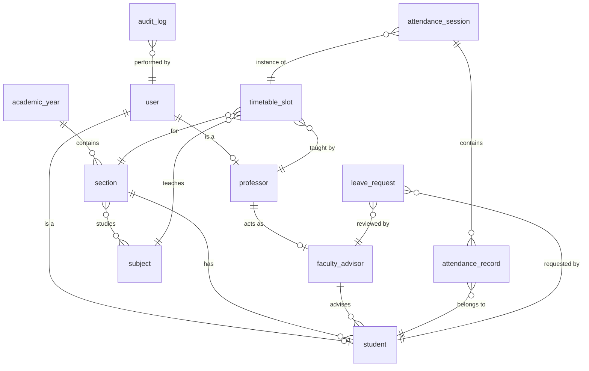

# CSE One - Volume 2
## Database Architecture & Domain Model

### 1. Database Overview
The database architecture for CSE One is an enterprise-grade, relational design optimized for PostgreSQL. Following the architectural foundation laid out in Volume 1, this database is strictly scoped to the Department of Computer Science and Engineering at S.A. Engineering College. It is normalized to the Third Normal Form (3NF) to guarantee data integrity, eliminate redundancy, and ensure highly consistent attendance and academic tracking. It features comprehensive audit logging, scalable relationships for analytics and reporting, and a robust security posture.

### 2. Domain Model
The Domain Model represents the real-world business entities within the CSE One ecosystem, detached from specific database tables.

- **Authentication Domain**: Secures entry into the system. Handles identities, credentials, and roles.
- **Academic Structure Domain**: Represents the hierarchical organization of the college, defining Years, Sections, Subjects, and the Timetable.
- **User Domain**: Represents the human actors: Students, Professors, Faculty Advisors, and Administrators.
- **Attendance Domain**: The core of the platform. Tracks instances of classes (Sessions) and the presence/absence of students (Records).
- **Leave Domain**: Manages requests by students to be excused, governed by Faculty Advisor workflows.
- **Notification Domain**: Handles asynchronous alerts and system messages.
- **Audit Domain**: An immutable ledger of critical operations for compliance and accountability.

### 3. Business Entities
For each domain, the primary business entities are:

#### 3.1. User (Base Entity)
- **Purpose:** Represents any individual capable of logging into the system.
- **Responsibilities:** Holds authentication details and role definitions.
- **Lifecycle:** Created by Administrator (for Professors/Advisors) or Faculty Advisor (for Students).
- **Ownership:** Administrator.

#### 3.2. Student
- **Purpose:** Represents an enrolled learner in the CSE department.
- **Responsibilities:** Contains academic metadata (Year, Section, Register Number).
- **Relationships:** Belongs to one Year/Section, assigned to one Faculty Advisor. Has many Attendance Records and Leave Requests.

#### 3.3. Professor & Faculty Advisor
- **Purpose:** Represents teaching staff and assigned mentors.
- **Responsibilities:** A Professor conducts Attendance Sessions. A Faculty Advisor manages a cohort of ~20 Students and approves/rejects leaves.
- **Relationships:** A Professor can be mapped as a Faculty Advisor. They conduct many Attendance Sessions.

#### 3.4. Academic Structure (Year, Section, Subject)
- **Purpose:** Defines the organizational taxonomy.
- **Responsibilities:** Groups students logically and maps them to the curriculum.
- **Relationships:** Years have Sections. Sections are enrolled in Subjects.

#### 3.5. Timetable Slot
- **Purpose:** Maps a Subject, Professor, Section, and Time.
- **Responsibilities:** Dictates when classes happen. Drives the automatic class detection in the Professor UI.

#### 3.6. Attendance Session & Attendance Record
- **Purpose:** A Session represents a single conducted class. A Record represents one student's status in that session.
- **Responsibilities:** Session locks the time and subject. Records hold Present/Absent/OD status and absence reasons.
- **Relationships:** One Session has Many Records.

#### 3.7. Leave Request
- **Purpose:** A formal request for absence.
- **Responsibilities:** Tracks the date range, reason, and approval status.
- **Relationships:** Created by Student, actioned by Faculty Advisor.

#### 3.8. Audit Log
- **Purpose:** Immutable tracking of changes.
- **Responsibilities:** Stores who did what, when, and the before/after state.

### 4. Entity Relationships
- **One-to-One:** Student to User (User holds auth, Student holds academic data). Professor to User.
- **One-to-Many:** 
  - Section to Students
  - Faculty Advisor to Students
  - Professor to Timetable Slots
  - Section to Timetable Slots
  - Timetable Slot to Attendance Sessions
  - Attendance Session to Attendance Records
  - Student to Leave Requests
- **Many-to-Many:** Resolved via Junction Tables.
  - Section to Subjects (Junction: `section_subject`)

### 5. ER Diagram

### 6. Logical Database Model
The logical model translates the domain into relational constructs.
- **Users Table:** Central authentication.
- **Students / Professors Tables:** Extensions of Users.
- **Academic Tables:** `academic_year`, `section`, `subject`, `section_subject`.
- **Scheduling Tables:** `timetable_slot`.
- **Attendance Tables:** `attendance_session`, `attendance_record`.
- **Leave Tables:** `leave_request`.
- **Audit Tables:** `audit_log`.

### 7. Physical Database Model
Target RDBMS: PostgreSQL.
- Primary Keys will use `UUID` (UUIDv4) for global uniqueness, facilitating disconnected creation and security against ID-guessing (Insecure Direct Object Reference).
- Foreign Keys will strictly enforce referential integrity.
- Timestamps will use `TIMESTAMP WITH TIME ZONE`.

### 8. Complete Table Specifications

#### 8.1. `users`
| Column | Type | Constraints | Purpose |
|---|---|---|---|
| id | UUID | PK | Primary Key |
| email | VARCHAR(255) | UNIQUE, NOT NULL | Authentication |
| password_hash | VARCHAR(255) | NOT NULL | Argon2 hash |
| role | VARCHAR(50) | NOT NULL | 'STUDENT', 'PROFESSOR', 'ADMIN' |
| is_active | BOOLEAN | DEFAULT TRUE | Soft disable account |
| created_at | TIMESTAMPTZ | DEFAULT NOW() | Audit |

#### 8.2. `academic_year`
| Column | Type | Constraints | Purpose |
|---|---|---|---|
| id | UUID | PK | Primary Key |
| year_level | INTEGER | NOT NULL, UNIQUE | 1, 2, 3, 4 |

#### 8.3. `section`
| Column | Type | Constraints | Purpose |
|---|---|---|---|
| id | UUID | PK | Primary Key |
| name | VARCHAR(10) | NOT NULL | A, B, C, D, E |
| academic_year_id | UUID | FK -> academic_year(id) | The year this section belongs to |
| UNIQUE(name, academic_year_id) | | | Prevent duplicate sections per year |

#### 8.4. `faculty_advisor`
| Column | Type | Constraints | Purpose |
|---|---|---|---|
| id | UUID | PK | Primary Key |
| professor_id | UUID | FK -> users(id), UNIQUE | Professor acting as FA |

#### 8.5. `student`
| Column | Type | Constraints | Purpose |
|---|---|---|---|
| id | UUID | PK | Primary Key, FK -> users(id) |
| register_number | VARCHAR(50) | UNIQUE, NOT NULL | Institution ID |
| first_name | VARCHAR(100) | NOT NULL | |
| last_name | VARCHAR(100) | NOT NULL | |
| section_id | UUID | FK -> section(id) | |
| faculty_advisor_id | UUID | FK -> faculty_advisor(id) | assigned FA |

#### 8.6. `professor`
| Column | Type | Constraints | Purpose |
|---|---|---|---|
| id | UUID | PK | Primary Key, FK -> users(id) |
| employee_id | VARCHAR(50) | UNIQUE, NOT NULL | |
| first_name | VARCHAR(100) | NOT NULL | |
| last_name | VARCHAR(100) | NOT NULL | |

#### 8.7. `subject`
| Column | Type | Constraints | Purpose |
|---|---|---|---|
| id | UUID | PK | Primary Key |
| code | VARCHAR(20) | UNIQUE, NOT NULL | Subject Code |
| name | VARCHAR(255) | NOT NULL | Subject Name |

#### 8.8. `timetable_slot`
| Column | Type | Constraints | Purpose |
|---|---|---|---|
| id | UUID | PK | Primary Key |
| section_id | UUID | FK -> section(id) | |
| subject_id | UUID | FK -> subject(id) | |
| professor_id | UUID | FK -> professor(id) | |
| day_of_week | INTEGER | NOT NULL | 1 (Mon) to 5 (Fri) |
| start_time | TIME | NOT NULL | |
| end_time | TIME | NOT NULL | |

#### 8.9. `attendance_session`
| Column | Type | Constraints | Purpose |
|---|---|---|---|
| id | UUID | PK | Primary Key |
| timetable_slot_id| UUID | FK -> timetable_slot(id) | |
| session_date | DATE | NOT NULL | Date of the class |
| recorded_by | UUID | FK -> professor(id) | Professor who marked it |
| created_at | TIMESTAMPTZ | DEFAULT NOW() | |
| UNIQUE(timetable_slot_id, session_date) | | | One session per slot per day |

#### 8.10. `attendance_record`
| Column | Type | Constraints | Purpose |
|---|---|---|---|
| id | UUID | PK | Primary Key |
| session_id | UUID | FK -> attendance_session(id) | |
| student_id | UUID | FK -> student(id) | |
| status | VARCHAR(20) | NOT NULL | PRESENT, ABSENT, OD |
| reason | TEXT | NULL | Reason for absence |
| prior_leave_id | UUID | FK -> leave_request(id) | Link to approved leave |
| UNIQUE(session_id, student_id) | | | One record per student per session |

#### 8.11. `leave_request`
| Column | Type | Constraints | Purpose |
|---|---|---|---|
| id | UUID | PK | Primary Key |
| student_id | UUID | FK -> student(id) | |
| start_date | DATE | NOT NULL | |
| end_date | DATE | NOT NULL | |
| reason | TEXT | NOT NULL | |
| status | VARCHAR(20) | DEFAULT 'PENDING' | PENDING, APPROVED, REJECTED |
| reviewed_by | UUID | FK -> faculty_advisor(id) | |
| reviewed_at | TIMESTAMPTZ | NULL | |

#### 8.12. `audit_log`
| Column | Type | Constraints | Purpose |
|---|---|---|---|
| id | UUID | PK | Primary Key |
| user_id | UUID | FK -> users(id) | Who |
| action | VARCHAR(100) | NOT NULL | What |
| entity_type | VARCHAR(100) | NOT NULL | Table name |
| entity_id | UUID | NOT NULL | Record ID |
| previous_value | JSONB | NULL | Before state |
| new_value | JSONB | NULL | After state |
| ip_address | VARCHAR(45) | NULL | Network origin |
| created_at | TIMESTAMPTZ | DEFAULT NOW() | When |

### 9. Constraints
- **Primary Keys:** Exclusively `UUID` via `uuid_generate_v4()`.
- **Foreign Keys:** Must exist. Prevent orphaned records.
- **Unique Constraints:** Applied to prevent duplicate users (email), duplicate sessions (slot + date), and duplicate attendance records (session + student).
- **Check Constraints:** Attendance status must be in ('PRESENT', 'ABSENT', 'OD'). Leave status in ('PENDING', 'APPROVED', 'REJECTED').

### 10. Index Strategy
Indexes are critical for read-heavy operations:
- **Login:** `CREATE INDEX idx_users_email ON users(email);`
- **Attendance Search:** `CREATE INDEX idx_att_record_student ON attendance_record(student_id);` and `CREATE INDEX idx_att_session_date ON attendance_session(session_date);`
- **Timetable Resolution:** `CREATE INDEX idx_timetable_prof_day ON timetable_slot(professor_id, day_of_week);`
- **Analytics:** `CREATE INDEX idx_leave_student_status ON leave_request(student_id, status);`

### 11. Naming Standards
- **Tables:** `snake_case`, singular (e.g., `student`, not `students` except for `users` which is standard convention).
- **Columns:** `snake_case`. Primary keys are always `id`. Foreign keys are `[entity]_id`.
- **Indexes:** Prefix with `idx_` followed by table and column (e.g., `idx_student_section_id`).
- **Constraints:** Foreign keys use `fk_[table]_[column]`.

### 12. Data Integrity Rules
- **Referential Integrity:** Strictly enforced at the database level.
- **Delete Rules (Cascade vs Restrict):**
  - RESTRICT is used for almost everything (e.g., cannot delete a `section` if it has `student`s).
  - CASCADE is used cautiously only for weak entities (e.g., deleting an `attendance_session` cascades to `attendance_record`).
- **Update Rules:** Updates to UUIDs are prohibited.

### 13. Security Strategy
- **Database Roles:** Minimum two roles: `cse_one_admin` (DDL access for migrations) and `cse_one_app` (DML access only, used by FastAPI).
- **Least Privilege:** The application user cannot DROP tables or TRUNCATE.
- **Encrypted Password Storage:** Handled by backend (Argon2), but DB ensures no plain text is stored by sizing `password_hash` appropriately.
- **Row-Level Security (RLS):** Not strictly necessary as the backend enforces tenancy (department scope) and RBAC, but can be enabled if multi-department scaling is required in the future.

### 14. Backup Strategy
- **Daily Backup:** Automated `pg_dump` running at 02:00 AM, dumping custom format (`-Fc`) to a secure intranet NAS.
- **Weekly Backup:** Full logical and physical backups retained off-site or on a separate secure server.
- **Point-in-Time Recovery (PITR):** Write-Ahead Logging (WAL) archiving enabled for recovery up to the minute in case of catastrophic failure.

### 15. Performance Strategy
- **JSONB for Audit Logs:** Utilizing `JSONB` in the `audit_log` allows unstructured state capture without massive schema alterations, natively indexed by Postgres (GIN index) if searching logs becomes necessary.
- **Query Optimization:** Strict adherence to indexing foreign keys and filtering columns (e.g., `session_date`).
- **Partitioning:** If the `attendance_record` table grows beyond 10 million rows, it will be partitioned by `session_date` (e.g., monthly partitions). For a single department, this will take decades, so partitioning is reserved for future scalability.

### 16. Migration Strategy
- **Tool:** Alembic (integrated with SQLAlchemy).
- **Workflow:** 
  1. Define changes in SQLAlchemy models.
  2. Generate revision script (`alembic revision --autogenerate`).
  3. Manually review script for destructive operations (drops, alters).
  4. Apply via `alembic upgrade head` in CI/CD pipeline.
- **Rollbacks:** Every migration must have a valid `downgrade` path.

### 17. Future Scalability
- **Multi-Department Extension:** If approved for the whole college, a `department` table will be introduced, and `department_id` will be added to `academic_year`, `users`, and `subject`.
- **Soft Deletes:** 
  - **Strategy:** We will use an `is_active` boolean on master entities (Users, Subjects, Sections).
  - **Reasoning:** `deleted_at` complicates unique constraints. `is_active` allows for filtering active records while retaining historical attendance integrity. Hard deletes are forbidden for anything generating audit trails.

### 18. Database Architecture Decision Record (ADR)
- **ADR-DB-001: UUID over BIGINT:** Chosen to prevent insecure direct object reference (IDOR) attacks. UUIDv4 ensures that knowing one student's ID doesn't allow guessing another's. Storage overhead is negligible for a department-scale app.
- **ADR-DB-002: Soft Deletion via is_active:** Chosen over hard deletion. If a professor leaves, we cannot delete their record because historical attendance sessions reference their ID. They are marked `is_active = FALSE`.
- **ADR-DB-003: JSONB for Audit Values:** Chosen because the shape of data changes per entity. Standardizing on JSONB allows a single robust `audit_log` table without EAV anti-patterns.
