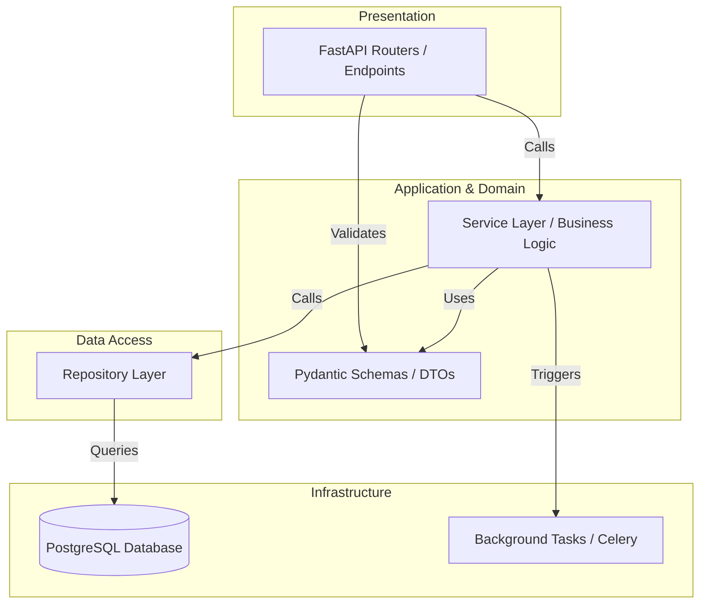

# CSE One - Volume 3
## Backend Architecture & API Engineering

### 1. Backend Overview
The CSE One backend is a robust, high-performance API layer engineered using FastAPI (Python). It acts as the central nervous system for the Intelligent Attendance and Academic Operations Platform, serving the Next.js Progressive Web Application. Designed for enterprise-grade deployment at S.A. Engineering College, the backend is strictly scoped to the Department of Computer Science and Engineering. It manages authentication, academic logic, attendance processing, and robust audit logging while guaranteeing high availability, extreme performance, and impeccable data integrity.

### 2. Architectural Principles
- **Clean Architecture & SOLID:** The backend is decoupled. Business logic does not depend on the database or the web framework.
- **Domain-Driven Design (DDD):** Organized around core academic domains (Attendance, Timetable, Leave, Users).
- **Separation of Concerns:** Distinct boundaries between routing (API), business logic (Services), and data access (Repositories).
- **Statelessness:** REST APIs maintain no client session state. All context is derived from JWTs.
- **Fail-Fast:** Inputs are strictly validated at the perimeter via Pydantic before touching business logic.

### 3. Layered Architecture
1. **Presentation Layer (API):** Defines FastAPI Routers. Handles HTTP requests/responses, status codes, and HTTP-level exceptions.
2. **Application Layer:** Translates DTOs (Data Transfer Objects) and delegates tasks. Handles dependency injection.
3. **Service Layer (Business Logic):** Where business rules reside (e.g., "A student cannot apply for leave on a past date"). Pure Python.
4. **Repository Layer:** Abstract data access. Translates domain queries into SQLAlchemy operations.
5. **Infrastructure Layer:** Database connections, Redis integrations, Email clients.
6. **Database:** PostgreSQL.

### 4. Clean Architecture Diagram


### 5. Folder Structure
```text
backend/
├── app/
│   ├── api/                 # API Layer
│   │   ├── dependencies/    # FastAPI Dependencies (Auth, DB session)
│   │   └── v1/              # API Version 1 Routers
│   │       ├── auth/
│   │       ├── students/
│   │       ├── professors/
│   │       ├── faculty_advisors/
│   │       ├── attendance/
│   │       ├── timetable/
│   │       ├── leave/
│   │       ├── analytics/
│   │       ├── reports/
│   │       ├── notifications/
│   │       └── admin/
│   ├── core/                # Core configurations (Settings, Security)
│   ├── db/                  # Database Infrastructure
│   │   ├── session.py       # Engine & Session Maker
│   │   └── base.py          # SQLAlchemy Base
│   ├── models/              # SQLAlchemy ORM Models
│   ├── schemas/             # Pydantic Validation Models
│   ├── repositories/        # Data Access Layer
│   ├── services/            # Business Logic Layer
│   ├── utils/               # Helper functions
│   ├── exceptions/          # Custom Domain Exceptions
│   └── main.py              # FastAPI Application Entrypoint
├── alembic/                 # Database Migrations
├── tests/                   # Pytest suites
└── requirements.txt         # Dependencies
```

### 6. Module Responsibilities
- **API (`api/v1/`)**: Exposes REST endpoints, injects dependencies.
- **Core (`core/`)**: Manages environment variables, JWT setup, CORS, and Argon2 hashing configurations.
- **Models (`models/`)**: Defines database schema translating directly to tables.
- **Schemas (`schemas/`)**: Validates incoming JSON and serializes outbound JSON.
- **Repositories (`repositories/`)**: Wraps SQLAlchemy queries. Example: `student_repo.get_by_register_number(db, reg_no)`.
- **Services (`services/`)**: Orchestrates rules. Example: `attendance_service.mark_student(db, session_id, student_id, status)`.

### 7. API Design Standards
- **Versioning:** `Base URL: /api/v1/`
- **Naming Conventions:** Kebab-case, plural nouns for resources (e.g., `/api/v1/faculty-advisors`).
- **HTTP Methods:** 
  - `GET`: Retrieve data.
  - `POST`: Create data.
  - `PUT`: Full update.
  - `PATCH`: Partial update.
  - `DELETE`: Remove/Deactivate data.
- **Pagination:** Query parameters `?skip=0&limit=100`.
- **Filtering & Searching:** Query parameters `?status=PENDING&q=John`.
- **Status Codes:** 200 (OK), 201 (Created), 204 (No Content), 400 (Bad Request), 401 (Unauthorized), 403 (Forbidden), 404 (Not Found), 500 (Internal Server Error).

### 8. Authentication Design
- **Mechanism:** Stateless JWT (JSON Web Tokens).
- **Access Token:** Short-lived (e.g., 15 minutes). Sent via HTTP Authorization header (`Bearer <token>`).
- **Refresh Token:** Long-lived (e.g., 7 days). Stored in a secure, HttpOnly cookie to prevent XSS exfiltration.
- **Password Hashing:** Argon2id parameters optimized for memory hardness.
- **Operations:** Login (generates tokens), Logout (invalidates refresh token on client, optionally blacklists in DB), Password Reset (via secure reset links).

### 9. Authorization (RBAC)
Role-Based Access Control matrix enforced via FastAPI dependencies.
- **Student:** Can view own attendance, submit leave, view own profile.
- **Professor:** Can view timetable, mark/update attendance for their assigned classes, view class analytics.
- **Faculty Advisor:** Can view cohort analytics, approve/reject leaves, manage student onboarding.
- **Administrator:** Can manage master data (Timetable, Users, Subjects), view global audit logs and department analytics.

### 10. Dependency Injection Strategy
FastAPI's `Depends` is utilized pervasively.
- **Why:** To decouple request lifecycle from resource management (like DB sessions) and to easily mock dependencies during testing.
- **Where:** Route definitions.
- **How:** 
  ```python
  def get_current_user(token: str = Depends(oauth2_scheme), db: Session = Depends(get_db)):
  ```
  This ensures every request receives a clean database session that automatically closes, and a securely validated user object.

### 11. Repository Pattern
Repositories act as the single source of truth for database interactions.
- **Rule:** A Service must never write a raw SQL query or directly call `db.query()`. It must call a Repository method.
- **Benefit:** If the ORM changes or queries need optimization, the business logic (Service) remains completely untouched.

### 12. Service Layer
The brain of the backend. 
- **Example:** `LeaveService.approve_leave(leave_id, advisor_id)`
  1. Calls `LeaveRepo` to fetch leave.
  2. Verifies `advisor_id` matches the student's assigned Faculty Advisor.
  3. Updates leave status.
  4. Calls `AttendanceRepo` to retroactively update records if attendance was already marked absent.
  5. Calls `NotificationService` to alert the student.

### 13. Validation Strategy
Strict perimeter validation using **Pydantic V2**.
- **Request Validation:** Ensures incoming JSON matches exactly what is expected (data types, lengths, regex for emails).
- **Response Validation:** Strips sensitive fields (like password hashes) before sending JSON back to the client (`response_model`).
- **Business Validation:** Handled in the Service layer (e.g., checking if a Timetable slot overlaps).

### 14. Error Handling Strategy
Centralized exception handling via FastAPI Exception Handlers.
- Custom Exceptions inherit from a base `AppException`.
- A global handler catches `AppException` and formats a standard JSON response:
  ```json
  {
    "error": "LEAVE_NOT_FOUND",
    "message": "The requested leave application does not exist.",
    "status_code": 404
  }
  ```
- Prevents stack traces from ever leaking in production.

### 15. Logging Strategy
Standard Python `logging` module configured for enterprise.
- **Application Logs:** INFO level. Tracks general flow.
- **Error Logs:** ERROR level. Captures full stack traces for unexpected 500s.
- **Format:** JSON formatted logs suitable for ingestion by centralized logging stacks (e.g., ELK, Grafana Loki).

### 16. Audit Logging
Every mutation (POST, PUT, PATCH, DELETE) affecting critical domains generates an Audit Log.
- **Mechanism:** A SQLAlchemy event listener or a decorator in the Service layer intercepts the change.
- **Captured Data:** User ID, Action, Entity Type, Entity ID, Previous JSON state, New JSON state, IP Address.
- **Immutability:** Audit records are strictly append-only.

### 17. Attendance Engine Architecture
- **Session Creation:** Initiated automatically or manually when a Professor accesses the attendance screen for a Timetable slot.
- **Record Marking:** Bulk upsert capability via `AttendanceRepo` to ensure lightning-fast saves for a class of 60 students.
- **Modification:** Changes to an existing record trigger a specific `ATTENDANCE_MODIFIED` audit log, requiring a mandatory "reason for modification" string.

### 18. Timetable Engine Architecture
- **Resolution Logic:** The `TimetableService` calculates "Current Class" by matching the server's current localized timestamp (Day of week, Time) against the Professor's assigned `timetable_slots`.
- **Substitute Support:** An override table/flag allowing Admin to temporarily assign a Slot to a different Professor ID.

### 19. Leave Engine Architecture
- **State Machine:** Draft -> Pending -> Approved / Rejected.
- **Integration:** When a Leave is moved to 'Approved', an asynchronous event (or synchronous service call) scans `attendance_record` for the requested dates. If the student was marked 'Absent', it is converted to 'Prior Leave/OD' based on business rules.

### 20. Notification Engine Architecture
- **In-App:** A dedicated `notifications` table storing `user_id`, `message`, `type`, and `is_read`.
- **Delivery:** Fetched via standard REST polling or Server-Sent Events (SSE) / WebSockets (Future expansion).
- **Extensibility:** Interface designed to seamlessly plug in SMTP (Email) or SMS providers later without changing the core Engine.

### 21. Analytics Engine Architecture
- **Aggregation:** Heavy calculations (e.g., Department-wide attendance %) are executed via optimized SQL `GROUP BY` views or SQLAlchemy hybrid properties, not in Python memory.
- **Caching:** Expensive analytics endpoints can leverage `FastAPI-Cache` to serve sub-millisecond responses for Dashboards.

### 22. Report Engine Architecture
- **Data Extraction:** Service layer extracts flattened data dictionaries.
- **Generation:** Utilizes background tasks to generate PDF (via ReportLab/WeasyPrint) or Excel (via pandas/openpyxl) to prevent blocking the HTTP thread on large department reports.

### 23. Security Architecture
- **Protection Measures:** 
  - FastAPI native protections against SQL Injection (via SQLAlchemy parameterized queries).
  - CSRF protection via SameSite cookie attributes.
  - XSS protection via React (Frontend) and strict output serialization (Backend).
- **Rate Limiting:** Implemented via `slowapi` to prevent brute force attacks on the `/login` endpoint.
- **Secrets:** Managed exclusively via `.env` files loaded into Pydantic `BaseSettings`. No hardcoded secrets.

### 24. Background Task Architecture
- **FastAPI BackgroundTasks:** Used for lightweight, immediate asynchronous jobs (e.g., sending an approval email immediately after API response).
- **Future Readiness:** The architecture supports dropping in Celery/Redis for heavy scheduled jobs (e.g., nightly database cleanup, monthly automated report generation).

### 25. API Documentation Strategy
- **OpenAPI (Swagger):** Automatically generated by FastAPI at `/docs`.
- **ReDoc:** Available at `/redoc` for alternative viewing.
- **Standards:** All Pydantic models must include `Field(..., example="...")` and `description` to ensure the generated documentation is instantly usable by frontend developers.

### 26. Testing Strategy
- **Unit Testing:** Pytest for isolated Service layer logic (mocking Repositories).
- **Integration Testing:** Testing FastAPI endpoints using `TestClient` and an isolated, rollback-wrapped test database.
- **Coverage Goal:** Minimum 85% line coverage for critical engines (Attendance, Auth).

### 27. Deployment Readiness
- **Dockerization:** A highly optimized `Dockerfile` utilizing multi-stage builds.
- **Server:** `Uvicorn` managed by `Gunicorn` with multiple worker processes to utilize multi-core Ubuntu servers.
- **Health Checks:** A `/api/v1/health` endpoint verifying database connectivity for Docker/NGINX load balancing.

### 28. Backend Architecture Decision Record (ADR)
- **ADR-BE-001: Pydantic V2:** Selected over V1 for the massive Rust-based performance improvements in JSON serialization.
- **ADR-BE-002: Repository Pattern over Active Record:** Enforces strict separation of business logic from data access, essential for a system with complex, interwoven rules like Attendance and Leave.
- **ADR-BE-003: FastAPI BackgroundTasks over Celery (Initially):** For the pilot phase on the intranet, external message brokers add unnecessary operational complexity. FastAPI's native background tasks are sufficient until scale dictates otherwise.
