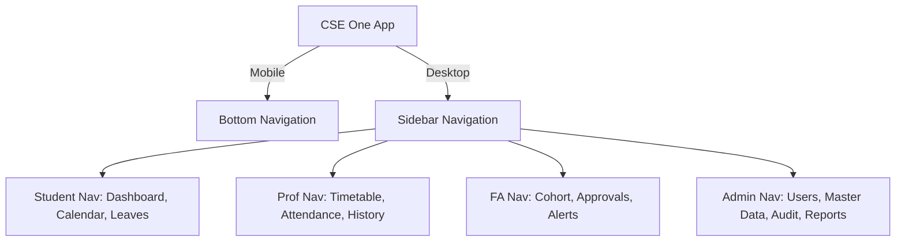

# CSE One - Volume 4
## Design System, Branding & UI/UX Architecture

### 1. Product Branding
CSE One operates under the banner **"One Department. One Platform."** 
- **Logo Guidelines:** A minimalistic typographic logo featuring "CSE" in heavy set Inter with "One" in a lighter weight, accompanied by a subtle institutional crest (abstracted for digital use). It must scale flawlessly from an app icon down to a 16px favicon.
- **Institution & Department Branding:** While explicitly built for the Department of Computer Science and Engineering at S.A. Engineering College, the branding avoids excessive crests or heavy legacy visuals. It takes the college's core navy blue and translates it into a digital-first, sleek identity.
- **Favicon & Splash Screen:** The favicon is a crisp, unadorned "C1". The splash screen centers the logo against the deep primary navy background, utilizing a subtle loading pulse rather than a generic spinner.

### 2. Visual Identity
The visual identity of CSE One is designed to evoke trust, academic rigor, and technological sophistication. It draws inspiration from enterprise powerhouses (Linear, Notion, GitHub) while maintaining institutional authority.
- **Tone:** Professional, precise, and understated.
- **Vibe:** It is NOT a generic college portal. It feels like premium B2B software.
- **Imagery:** Photography is restricted. Where imagery is necessary (e.g., empty states), custom vector illustrations in a monochromatic or duotone (navy/slate) style are used to prevent visual clutter.

### 3. Design Principles
- **Clarity over Density:** Data should breathe. Use ample whitespace.
- **Frictionless Action:** Core actions (e.g., marking attendance) should require zero scroll and minimal clicks.
- **Academic Reliability:** Avoid "gamified" UI elements. No neon, no excessive glassmorphism, no bouncy physics.
- **Accessibility as Standard:** High contrast text, explicit focus states, and logical tab orders are non-negotiable.

### 4. Color System
Strictly mapped to WCAG AA standards.
- **Primary:** Institutional Navy Blue (`#0F172A`)
- **Secondary:** Royal Blue (`#2563EB`)
- **Accent:** Slate (`#64748B`)
- **Background:** Crisp White (`#FFFFFF`) for light mode; Very Dark Blue (`#020617`) for future dark mode.
- **Surface:** Off-white/Light Gray (`#F8FAFC`) for cards and panels.
- **Semantic Colors:**
  - **Success / Present:** Deep Green (`#16A34A`)
  - **Danger / Absent:** Solid Red (`#DC2626`)
  - **Warning / OD / Pending:** Amber (`#D97706`)
  - **Info / Modified:** Soft Blue (`#3B82F6`)
- **Text:** 
  - Dark Text (Light Mode): `#0F172A`
  - Light Text (Dark Mode): `#F8FAFC`
  - Muted Text: `#64748B`

### 5. Typography
**Typeface:** Inter (Primary) / Poppins (Display Fallback).
- **Scale:**
  - **Display:** 48px, Semi-Bold, tight letter-spacing (-0.02em)
  - **H1:** 36px, Semi-Bold
  - **H2:** 24px, Medium
  - **H3:** 20px, Medium
  - **Body (Primary):** 16px, Regular, Line-height 1.5
  - **Body (Secondary):** 14px, Regular, Muted
  - **Caption/Label:** 12px, Medium, Uppercase, Tracking wide (0.05em)
  - **Data/Numbers:** Tabular lining enabled for all attendance matrices and grids.

### 6. Spacing System
A strict 8-point grid is enforced globally.
- **Micro:** 4px, 8px (Inner component spacing, input padding)
- **Small:** 16px (Card padding, list item gaps)
- **Medium:** 24px, 32px (Section margins, dialog padding)
- **Large:** 48px, 64px (Page margins, major layout divisions)

### 7. Grid System
- **Desktop (1024px+):** 12-column grid. 24px gutters. Sidebar locked at 256px. Content area utilizes the remaining fluid space, max-width bounded at 1440px for readability.
- **Tablet (768px - 1023px):** 8-column grid. 16px gutters. Sidebar collapses to icons or a drawer.
- **Mobile (<768px):** 4-column grid. 16px gutters. Bottom navigation replaces sidebar.

### 8. Iconography
Provided exclusively by **Lucide React**.
- **Sizing:** 16px (inline/buttons), 20px (sidebar nav), 24px (empty states), 48px (hero icons).
- **Styling:** Stroke width strictly set to 2px for crispness on high-DPI displays. Colors map to the muted text or primary brand color depending on state. 

### 9. Component Library (Base Guidelines)
Built on `shadcn/ui` and styled via Tailwind.
- **Buttons:** Subtle rounded corners (`radius-md`, 6px). Primary buttons use Royal Blue; Secondary use Surface Gray with Dark text.
- **Inputs:** Clean 1px border (`#CBD5E1`), focusing to a 2px Royal Blue ring (`ring-blue-500`).
- **Cards:** White background, minimal shadow (`shadow-sm`), 8px border radius. No heavy drop shadows.
- **Badges/Chips:** Used extensively for attendance. Pill-shaped (fully rounded).
- **Modals/Dialogs:** Dimmed backdrop (black 40% opacity), centered, clean entrance animation (fade + scale up 95%).

### 10. Navigation Architecture

- **Top Bar:** Breadcrumbs on the left (e.g., `Home / Attendance / CS-301`). User Profile and Notification Bell on the right.

### 11. Dashboard Design
- **Summary Cards (Top):** 4-column grid displaying key metrics (e.g., Attendance %, Pending Leaves).
- **Main Content (Left 8-col):** Primary actionable widget (e.g., "Today's Timetable" for Professors, "Attendance Calendar" for Students).
- **Context/Activity (Right 4-col):** Recent notifications, upcoming events, or quick action shortcuts.

### 12. Page Specifications
- **Login:** Split screen. Left: Institutional branding/illustration. Right: Clean form.
- **Attendance Capture (Professor):** Massive, touch-friendly rows for each student. Quick toggles for P/A/OD. Sticky "Save Attendance" bar at the bottom.
- **Student Profile:** High-density data view. Tabular breakdown of subjects, holistic attendance percentage chart, and leave history timeline.

### 13. Table Design
Enterprise-grade data grids.
- **Structure:** 48px row height. Alternating subtle row colors. Sticky table headers.
- **Interactivity:** Clickable column headers for sorting (indicated by Lucide chevron icons). Global search bar above the table.
- **Bulk Actions:** Checkboxes on the far left. When selected, a floating action bar appears overlaying the table header (e.g., "Mark 5 selected as Present").

### 14. Form Design
- **Layout:** Vertical stacking is preferred over horizontal grids to prevent eye-tracking fatigue.
- **Validation:** Real-time inline errors (Red 12px text) appearing directly below the input field on `blur`.
- **States:** Clear visual distinction for disabled inputs (grayed out, `cursor-not-allowed`) and loading states (button text replaced with spinner).

### 15. Motion Design
- **Transitions:** Handled by Framer Motion. 
- **Duration:** Fast. 150ms for hovers, 200ms for route changes, 300ms for drawer slides.
- **Easing:** `ease-out` for entering elements, `ease-in` for exiting elements.
- **Zero Flashiness:** No bounce, no wiggle. Elements fade in and slide up (Y-axis 10px) subtly.

### 16. Accessibility Standards
- **Keyboard:** Complete `Tab` index logical flow. Visible focus rings (`ring-2 ring-blue-500 ring-offset-2`) on all interactive elements.
- **ARIA:** Proper `aria-labels` for icon-only buttons (like the notification bell).
- **Contrast:** Guarantee that all text meets WCAG AA (4.5:1 ratio). Specifically, the Green and Red used for Present/Absent must be tested for colorblind safety.

### 17. Responsive Design
- The application is fundamentally mobile-first.
- Tables automatically convert to stacked card lists on screens `< 768px` to prevent horizontal scrolling nightmares.
- Touch targets on mobile are strictly `44px` minimum (Apple HIG / Android Material standard).

### 18. PWA UX Guidelines
- **Install Prompt:** An unobtrusive banner appearing after the user has successfully logged in twice.
- **Offline Mode:** If network drops, the app shell remains visible. A top-bar toast reads "You are currently offline. Viewing cached data."
- **App Shell:** The sidebar, top bar, and bottom nav must load instantly from cache, showing skeleton loaders for the main content area.

### 19. Report Templates
Designed for A4 PDF generation.
- **Header:** College Logo left-aligned. Department Name center. "Official Attendance Report" right-aligned.
- **Timestamp:** Digital generation timestamp printed on the bottom right footer.
- **Signatures:** Blank signature lines (`___________________`) for HOD and Faculty Advisor at the bottom of official PDF exports.
- **Styling:** Strictly Black and White optimized. Gray backgrounds for table headers.

### 20. Design Tokens (Extract)
```css
:root {
  --spacing-1: 0.25rem; /* 4px */
  --spacing-2: 0.5rem;  /* 8px */
  --spacing-4: 1rem;    /* 16px */
  
  --color-primary: #0F172A;
  --color-secondary: #2563EB;
  
  --color-success: #16A34A; /* Present */
  --color-danger: #DC2626;  /* Absent */
  --color-warning: #D97706; /* OD */
  
  --font-sans: 'Inter', sans-serif;
  
  --radius-md: 0.375rem; /* 6px */
}
```

### 21. UI Architecture Decision Record (ADR)
- **ADR-UI-001: Tailwind CSS + shadcn/ui:** Chosen to enforce the design token system at the utility class level, preventing ad-hoc CSS overrides and ensuring complete consistency across the large PWA.
- **ADR-UI-002: Bottom Nav for Mobile:** Chosen over a hamburger menu to provide faster, one-handed ergonomic access to core domains (Dashboard, Timetable, Notifications) for users standing in classrooms.
- **ADR-UI-003: Tabular Data for Attendance:** Chosen over grid/card views for desktop attendance history. The visual density of a table is required for professors analyzing patterns across 60 students over 30 days.
