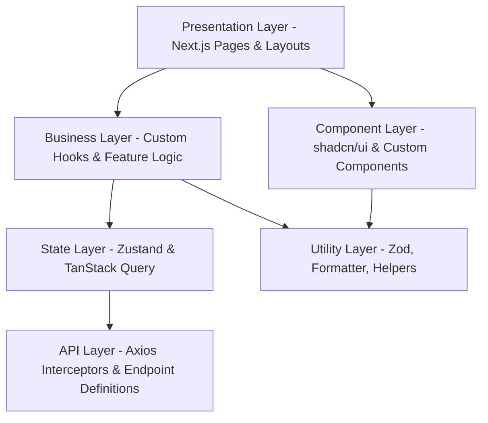

# CSE One - Volume 5
## PWA Frontend Architecture & Engineering Specification

### 1. Frontend Architecture Overview
The CSE One frontend is a highly optimized, enterprise-grade Progressive Web Application (PWA) built with **Next.js 15**, **React 19**, and **TypeScript**. Serving as the definitive digital interface for the Department of Computer Science and Engineering, it seamlessly integrates the architectural foundations defined in Volumes 1-4. The frontend is engineered for extreme performance, offline resilience, and strict type safety, delivering a native-app-like experience across desktop and mobile devices.

### 2. Frontend Engineering Principles
- **Strict Typing:** TypeScript is mandatory. `any` is forbidden. Every API response and component prop must be strongly typed.
- **Feature-Sliced Design:** Code is organized by business domain (e.g., `attendance`, `leave`) rather than purely by technical type (e.g., keeping all components together).
- **Server State vs. Client State:** Separation is strictly enforced. TanStack Query manages asynchronous server state; Zustand manages synchronous UI client state.
- **Fail-Fast Validation:** Zod schemas validate forms before submission and validate API payloads upon receipt to prevent runtime crashes.
- **Accessibility as a Requirement:** Not an afterthought. All components must be keyboard-navigable and screen-reader compliant (WCAG AA).

### 3. Layered Architecture
The frontend utilizes a clear separation of concerns to maintain decoupling and testability.



- **Presentation Layer:** Next.js App Router (`app/`). Responsible solely for routing, layouts, and rendering Feature Components.
- **Component Layer:** Reusable, dumb UI components (Buttons, Cards, Inputs).
- **Business Layer:** Custom hooks containing domain logic (`useSubmitLeave`, `useMarkAttendance`).
- **State Layer:** Caching, fetching, and global UI state.
- **API Layer:** Axios instance, interceptors, and strict endpoint wrappers.
- **Utility Layer:** Pure functions, constants, and Zod schemas.

### 4. Folder Structure
Enterprise structure following Feature-Sliced principles.

```text
frontend/
├── src/
│   ├── app/                 # Next.js 15 App Router (Pages, Layouts, Loading)
│   ├── components/          # Shared UI (shadcn/ui, base components)
│   │   ├── ui/              # Primitive components (Button, Input)
│   │   ├── layouts/         # Structural wrappers (Sidebar, Header)
│   │   └── shared/          # Reusable complexes (DataTable, PageHeader)
│   ├── features/            # Domain-driven modules
│   │   ├── auth/            # Login, Auth context
│   │   ├── attendance/      # Marking, History, Analytics
│   │   ├── leave/           # Requests, Approvals
│   │   ├── timetable/       # Today's classes, Management
│   │   └── users/           # Profile, Admin User Management
│   ├── hooks/               # Global custom hooks (useWindowSize, useDebounce)
│   ├── lib/                 # Third-party wrappers (axios, queryClient, utils)
│   ├── stores/              # Zustand global stores (useUIStore, useAuthStore)
│   ├── types/               # Global TypeScript definitions & API Interfaces
│   ├── constants/           # Global enums, configuration variables
│   ├── providers/           # Context Providers (QueryProvider, ThemeProvider)
│   ├── middleware.ts        # Next.js route protection & JWT inspection
│   ├── styles/              # Global CSS (Tailwind entry)
│   ├── assets/              # Static files (Icons, Images)
│   ├── utils/               # Pure functions (date formatters, math)
│   └── config/              # Environment configurations
├── public/                  # Manifest, Service Worker, Splash Screens
├── tailwind.config.ts       # Tailwind theme matching Volume 4
└── package.json
```

### 5. Routing Architecture
Controlled entirely via Next.js 15 App Router (`app/`).

```mermaid
graph TD
    Root[/]
    Login[/login]
    Dashboard[/dashboard]
    Attendance[/attendance]
    Leave[/leave]
    Admin[/admin]
    
    Root --> Login
    Root --> Dashboard
    
    Dashboard -->|Role: Student| Attendance
    Dashboard -->|Role: Student| Leave
    
    Dashboard -->|Role: Professor| Attendance
    
    Dashboard -->|Role: Admin| Admin
```

- **Public Routes:** `/login`, `/forgot-password`.
- **Protected Routes:** Guarded by `middleware.ts` which inspects the JWT cookie. If invalid, redirects to `/login`.
- **Role Guards:** Higher-Order Components (or Layout checks) validating the user's role against the required role for a route (e.g., `/admin` requires `ADMIN` role).
- **Error Pages:** Custom `not-found.tsx` (404), `error.tsx` (500), and custom 403 Forbidden screens matching the design system.

### 6. Layout Architecture
- **Public Layout:** Minimalist, centered form layout for authentication.
- **App Layout (Protected):**
  - **Sidebar:** Dynamic based on role. Contains primary navigation. Collapses to bottom nav on mobile.
  - **Header (Top Bar):** Breadcrumbs, Notifications, User Profile dropdown.
  - **Main Content:** Scrollable area where pages render.
- **Role-Specific Navigation Variations:**
  - *Student:* Focus on Profile, Calendar, Leave Application.
  - *Professor:* Focus on Today's Timetable, Attendance Session.
  - *Faculty Advisor:* Focus on Cohort Analytics, Leave Approvals.
  - *Administrator:* Focus on Master Data, User Creation, Reports.

### 7. Component Architecture
- **Atomic Design Principles:**
  - *Atoms:* Buttons, Inputs, Badges.
  - *Molecules:* Search Bars, Form Fields (Label + Input + Error).
  - *Organisms:* Data Tables, Complex Dialogs.
- **shadcn/ui Foundation:** Components are owned by the codebase (`src/components/ui`), allowing complete adherence to Volume 4 Design Tokens.
- **Strictly Typed:** Every component must define `interface ComponentProps`.
- **Domain Specific Components:** Placed in `src/features/[domain]/components` (e.g., `AttendanceChip`, `TimetableSlotCard`).

### 8. State Management Strategy
- **Server State (TanStack Query):** Handles all API fetching, caching, synchronization, and background updates.
  - *Why:* Eliminates need to manually write `useEffect` for data fetching. Provides instant UI updates via optimistic updates.
- **Global Client State (Zustand):** Handles purely UI-driven global state (e.g., Sidebar open/close, active theme).
  - *Why:* Lighter and faster than Redux. No boilerplate.
- **Local Component State (React `useState`):** Handles ephemeral state (e.g., modal open/close, local form toggles).

### 9. API Communication Strategy
- **Axios Client:** A globally configured Axios instance (`lib/axios.ts`).
- **Request Interceptor:** Automatically attaches the JWT `Authorization: Bearer` header from the secure store.
- **Response Interceptor:** Automatically catches `401 Unauthorized` errors, attempts to call the `/refresh-token` endpoint, and retries the original request seamlessly. If refresh fails, forces logout.
- **Error Handler:** Transforms Axios errors into standard JavaScript `Error` objects containing the backend's standard error payload.

### 10. Form Architecture
- **React Hook Form:** For performant form state management without re-rendering the entire component tree on every keystroke.
- **Zod Validation:** Schemas define exactly what a valid form looks like. These schemas are shared with the API layer when possible.
- **Standardized Fields:** A wrapper component `FormField` standardizes Labels, Inputs, and inline Error Messages.
- **Handling Submission:** 
  1. Validate via Zod.
  2. Mutate via TanStack Query `useMutation`.
  3. On success: Show Toast, reset form, invalidate relevant Query cache.
  4. On error: Show Toast, highlight fields if specific validation errors are returned from API.

### 11. Feature Module Architecture
Every feature (e.g., `attendance`) contains its own bounded context:
- `features/attendance/api/`: API calls (`markAttendance.ts`).
- `features/attendance/components/`: Specific UI (`AttendanceGrid.tsx`).
- `features/attendance/hooks/`: Business logic (`useAttendanceSession.ts`).
- `features/attendance/types/`: Types (`AttendanceRecord.ts`).
- `features/attendance/utils/`: Helpers (`calculatePercentage.ts`).

### 12. PWA Architecture
- **Manifest (`manifest.json`):** Defines app name, theme colors (Navy Blue), background colors, and high-res app icons for home screen installation.
- **Service Worker (`next-pwa`):** 
  - **Caching Strategy:** 
    - Stale-While-Revalidate for API GET requests.
    - Cache-First for static assets (fonts, images, CSS).
    - Network-Only for mutations (POST, PUT, DELETE).
- **Offline Strategy:** If network drops, TanStack Query pauses mutations and queues them. The UI displays an "Offline Mode" toast. Cached data remains fully interactive.
- **Install Prompt:** Triggered contextually to encourage students/professors to "Add to Home Screen".

### 13. Performance Strategy
- **Image Optimization:** Strict use of Next.js `<Image />` component.
- **Dynamic Imports:** Non-critical heavy components (e.g., Recharts) are loaded via `next/dynamic` (`React.lazy`).
- **Font Optimization:** `next/font/google` preloads Inter and Poppins at build time. Zero layout shift.
- **Prefetching:** Next.js `<Link>` automatically prefetches routes. TanStack Query prefetches data on hover for heavy dashboard actions.
- **Virtualization:** Attendance tables containing 60+ students utilize virtualized lists (`@tanstack/react-virtual`) if performance degrades on low-end mobile devices.

### 14. Security Strategy
- **JWT Storage:** Access Token kept in memory (Zustand) or tightly scoped closure. Refresh Token stored in a strict `HttpOnly`, `Secure`, `SameSite=Strict` cookie handled exclusively by the backend.
- **XSS Prevention:** React natively escapes string variables. Strict usage of `dangerouslySetInnerHTML` (essentially forbidden).
- **Route Protection:** Next.js Middleware acts as the perimeter guard, preventing even the loading of protected JS bundles if unauthenticated.

### 15. Accessibility Strategy
- **Keyboard Navigation:** Ensured via `shadcn/ui` Radix primitives.
- **Focus Management:** Modals trap focus. Dialog closures return focus to the triggering element.
- **ARIA:** All interactive non-text elements (Icons) have `aria-label`. Data tables use standard ARIA grid attributes.

### 16. Error Handling Strategy
- **Error Boundaries:** Next.js `error.tsx` catches rendering crashes and displays a branded Fallback UI with a "Try Again" button.
- **Toast Messages:** Non-blocking alerts for API failures (e.g., "Failed to save attendance").
- **API Errors:** Standardized across the application. TanStack Query's `onError` global callback routes critical errors directly to the Toast system.

### 17. Testing Strategy
- **Unit Testing:** Vitest + React Testing Library for testing utility functions and complex custom hooks.
- **Component Testing:** Visual regression and interaction testing for complex UI (e.g., Attendance Grid).
- **E2E Testing:** Playwright or Cypress for testing critical user flows: Login -> Mark Attendance -> Logout.

### 18. Frontend Architecture Decision Record (ADR)
- **ADR-FE-001: Next.js App Router over Pages Router:** Selected for superior server-side rendering, layout nesting, and modern React 19 concurrent features.
- **ADR-FE-002: Zustand over Redux:** Chosen to eliminate boilerplate. Global state is minimal since TanStack Query handles server state.
- **ADR-FE-003: Feature-Sliced Design:** Chosen over flat component folders to prevent the `src/` directory from becoming a monolithic, unmaintainable mess as the application grows.
- **ADR-FE-004: Tailwind + shadcn/ui:** Chosen to enforce the precise design tokens from Volume 4 without the overhead of massive CSS-in-JS runtimes like styled-components.
