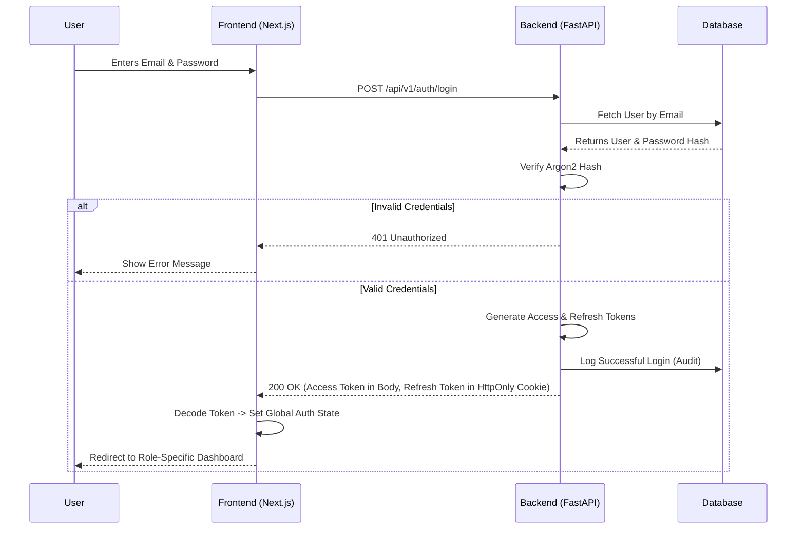

# CSE One - Volume 6
## Authentication, Authorization & Identity Management

### 1. Authentication Overview
The Authentication and Identity Management architecture for CSE One is a robust, token-based system designed to strictly secure the Progressive Web Application (PWA) and FastAPI backend. It utilizes stateless JSON Web Tokens (JWT) for authentication and a granular Role-Based Access Control (RBAC) model for authorization. Designed specifically for the Department of Computer Science and Engineering at S.A. Engineering College, it mandates the use of college-issued email addresses and establishes a secure perimeter that defends against modern web vulnerabilities (XSS, CSRF, Injection) while providing a frictionless experience for Students, Professors, Faculty Advisors, and Administrators.

### 2. Identity Model
Identity in CSE One revolves around a unified `User` entity, bridging authentication credentials with domain-specific profiles.
- **Base User:** Contains `id`, `email`, `password_hash`, `role`, and `is_active`. This entity solely handles authentication.
- **Student Profile:** A 1:1 extension of the User table, storing academic context (`register_number`, `year`, `section`) and linking to a `Faculty Advisor`.
- **Professor Profile:** A 1:1 extension of the User table, storing employment context (`employee_id`) and linking to `Timetable Slots`.
- **Faculty Advisor Identity:** A functional role mapped to a Professor, granting them administrative oversight over a cohort of Students.
- **Administrator Identity:** A base User with the `ADMIN` role. No extended profile is required.

### 3. Login Workflow
The system utilizes a unified login interface. Roles are automatically detected by the backend based on the provided credentials.



### 4. RBAC Model
CSE One operates on a strict, deny-by-default Role-Based Access Control model.
- **Student:** Can read own data, write leave requests. Restricted from viewing peers' data.
- **Professor:** Can read own timetable, write attendance records for assigned classes. Restricted from approving leaves.
- **Faculty Advisor:** Inherits Professor capabilities. Can read cohort data, write leave approvals/rejections, and write new Student accounts.
- **Administrator:** Can write master data (Timetable, Users, Subjects). Cannot mark attendance or approve leaves to maintain academic integrity segregation.

### 5. Permission Matrix
| Feature / Module | Student | Professor | Faculty Advisor | Administrator |
| :--- | :---: | :---: | :---: | :---: |
| **Login / Logout** | ✅ | ✅ | ✅ | ✅ |
| **View Own Dashboard** | ✅ | ✅ | ✅ | ✅ |
| **View Own Attendance** | ✅ | ❌ | ❌ | ❌ |
| **Mark Attendance** | ❌ | ✅ | ✅ | ❌ |
| **Modify Attendance** | ❌ | ✅ | ✅ | ❌ |
| **Submit Leave Request** | ✅ | ❌ | ❌ | ❌ |
| **Approve/Reject Leave** | ❌ | ❌ | ✅ | ❌ |
| **Create Student Account**| ❌ | ❌ | ✅ | ❌ |
| **Create Professor Acc.** | ❌ | ❌ | ❌ | ✅ |
| **Manage Timetable** | ❌ | ❌ | ❌ | ✅ |
| **View Dept Analytics** | ❌ | ❌ | ❌ | ✅ |
| **View Audit Logs** | ❌ | ❌ | ❌ | ✅ |

### 6. Token Management Strategy
- **Access Token (JWT):** 
  - *Lifetime:* 15 minutes.
  - *Storage:* Kept in memory by the React application (Zustand). Never stored in `localStorage` to prevent XSS theft.
  - *Payload:* `sub` (User ID), `role`, `exp`, `iat`.
- **Refresh Token (JWT or Opaque String):**
  - *Lifetime:* 7 days.
  - *Storage:* Secure, `HttpOnly`, `SameSite=Strict` cookie managed by the browser. Inaccessible to JavaScript.
- **Silent Refresh Flow:**
  - Before the Access Token expires (or upon receiving a 401 response), the frontend Axios interceptor calls `POST /api/v1/auth/refresh`.
  - The browser automatically attaches the `HttpOnly` Refresh Token cookie.
  - The backend validates the refresh token, issues a new Access Token (body), and sets a new Refresh Token (cookie).

### 7. Password Management Policy
- **Hashing Algorithm:** `Argon2id` (Provides resistance against GPU cracking and side-channel attacks).
- **Complexity:** Minimum 8 characters, at least one uppercase, one lowercase, and one number.
- **Initial Provisioning:** When an Admin creates a Professor (or FA creates a Student), the system generates a temporary password and emails it to the user.
- **Forced Reset:** Upon first login with a temporary password, the user is forced into a "Change Password" workflow before proceeding.
- **Password Reset:** Standard forgot-password workflow utilizing a short-lived secure token sent via college email.

### 8. Account Lifecycle
1. **Creation:** 
   - Admins create Professors and designate Faculty Advisors.
   - Faculty Advisors bulk-import or manually create Students for their cohort.
2. **Activation:** Account is implicitly active upon creation.
3. **Deactivation:** Users are never hard-deleted to preserve historical attendance data. Instead, `is_active` is set to `FALSE`. Deactivated users cannot log in.
4. **Role Updates:** Handled strictly by Administrators.

### 9. Session Management
- **Stateless Nature:** The backend holds no session state in memory. 
- **Logout:** 
  - *Frontend:* Clears the Access Token from memory and redirects to `/login`.
  - *Backend:* The client calls `POST /api/v1/auth/logout`. The backend clears the `HttpOnly` refresh cookie via `Set-Cookie` header with an immediate expiration.
- **Logout All Devices:** Handled by incrementing a `token_version` integer on the `User` table. The backend checks this version during the refresh flow. Incrementing it invalidates all currently issued refresh tokens.
- **Idle Timeout:** If the application is closed and the Access Token expires in memory, the user must log in again unless the background refresh timer keeps it alive (which stops when the tab closes).

### 10. Frontend Authentication Flow
- **Boot Sequence:** Next.js loads. Client-side script attempts a silent refresh to hydrate the Auth state. If successful, renders App. If failed, renders Login page.
- **Route Guards:** High-Order Components wrap protected pages. Example: `<ProtectedRoute allowedRoles={['PROFESSOR', 'ADMIN']}>`.
- **Axios Interceptor:** 
  ```javascript
  api.interceptors.response.use(
    (response) => response,
    async (error) => {
      // Catch 401 and trigger silent refresh
      // If refresh fails, clear state and redirect to /login
    }
  );
  ```

### 11. Backend Authentication Architecture
- **Dependencies (`Depends`):**
  - `get_current_user`: Extracts the Bearer token, verifies signature and expiration, looks up the user in the DB.
  - `require_role(allowed_roles: List[str])`: A dependency factory that first calls `get_current_user`, then checks if `user.role` is in the allowed list. If not, raises `HTTPException(403 Forbidden)`.
- **API Endpoints:**
  - `POST /api/v1/auth/login`
  - `POST /api/v1/auth/refresh`
  - `POST /api/v1/auth/logout`
  - `POST /api/v1/auth/reset-password`

### 12. Security Controls (OWASP Aligned)
- **Brute-Force:** `slowapi` rate limiting restricts `/login` to 5 attempts per minute per IP.
- **XSS (Cross-Site Scripting):** Mitigated by keeping Access Tokens in memory and avoiding `localStorage`. Next.js handles HTML escaping.
- **CSRF (Cross-Site Request Forgery):** Mitigated by the `SameSite=Strict` flag on the refresh token cookie, ensuring it is only sent for same-origin requests.
- **SQL Injection:** Mitigated entirely by SQLAlchemy ORM parameterized queries.
- **Token Theft:** Short lifespan (15m) of Access Tokens significantly reduces the window of opportunity if stolen.

### 13. Audit Logging
Every auth event triggers an immutable entry in the `audit_log` table.
- **Events Logged:** `LOGIN_SUCCESS`, `LOGIN_FAILED`, `LOGOUT`, `PASSWORD_CHANGED`, `PASSWORD_RESET_REQUESTED`, `USER_CREATED`, `USER_DEACTIVATED`.
- **Payload Capture:** Time, User Email, Action, IP Address (retrieved via `Request.client.host`), User-Agent string.

### 14. Error Handling
Consistent API JSON responses for auth failures.
- `401 Unauthorized`: Missing token, expired token, or invalid credentials.
- `403 Forbidden`: Token is valid, but the role lacks permission for the endpoint.
- `400 Bad Request`: Validation errors on login payload (e.g., malformed email).
- `422 Unprocessable Entity`: Temporary password requires change.

### 15. Testing Strategy
- **Unit Tests:** Verify Argon2 hashing wrappers and JWT encode/decode functions.
- **Integration Tests:** 
  - Test `/login` with valid/invalid credentials.
  - Test RBAC: Attempt to access a Professor route using a Student JWT (assert 403 response).
  - Test Token Refresh cycle using Pytest `TestClient`.
- **Security Scans:** Automated dependency scanning for known vulnerabilities in cryptographic libraries (e.g., `python-jose`, `passlib`).

### 16. Authentication Architecture Decision Record (ADR)
- **ADR-AUTH-001: JWT over Session Cookies:** Chosen to support horizontal scalability of the FastAPI backend and ease future mobile app integration.
- **ADR-AUTH-002: HttpOnly Refresh Token:** Chosen as the most secure compromise to mitigate XSS (by hiding the refresh token) while utilizing the short-lived access token for stateless API authorization.
- **ADR-AUTH-003: Argon2 over Bcrypt:** Chosen because Argon2 is the winner of the Password Hashing Competition and provides superior defense against GPU-based cracking attempts compared to Bcrypt.
