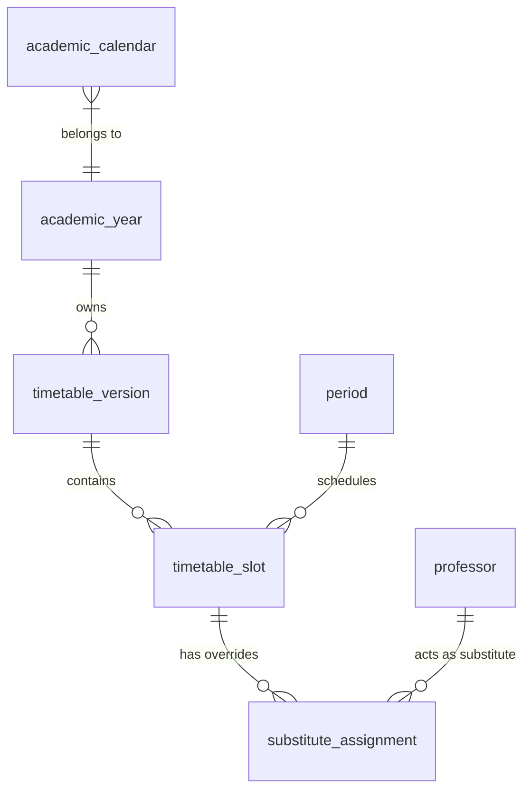
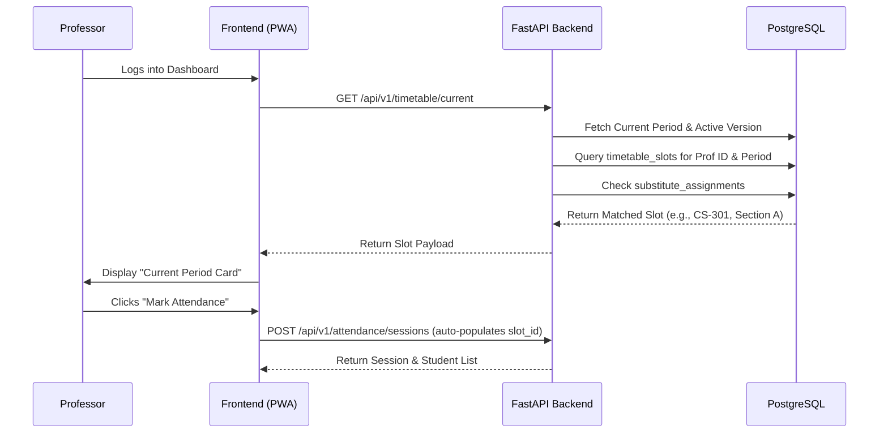
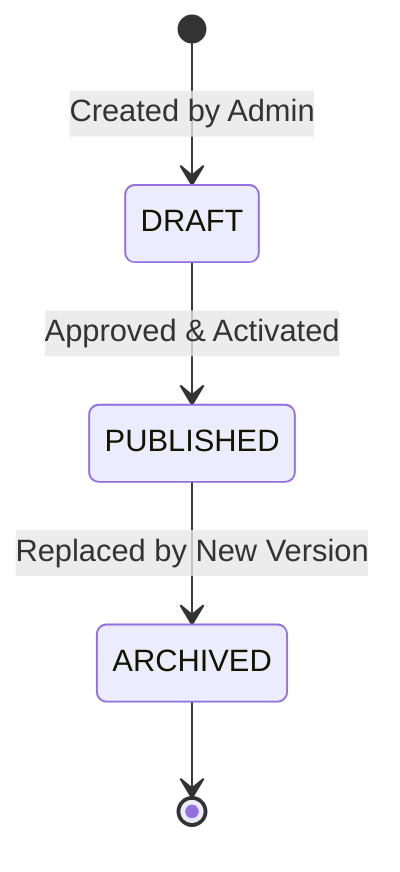

# CSE One - Volume 7
## Academic Structure & Intelligent Timetable Engine

### 1. Academic Structure Overview
The academic structure is the foundational spine of CSE One, explicitly tailored for the Department of Computer Science and Engineering at S.A. Engineering College. The system abstracts away manual data entry by strictly associating Students, Professors, and Faculty Advisors with specific Years, Sections, and Subjects. The Timetable Engine sits atop this structure, acting as the intelligent driver that dictates when and where academic events occur, ensuring that Attendance Sessions are automatically generated rather than manually initiated.

### 2. Academic Entity Design
- **Academic Year:** Represents the current running year (e.g., 2026-2027) and Semester (Odd/Even).
- **Year Level:** I, II, III, IV Year.
- **Section:** A, B, C, D, E.
- **Subject:** Contains Subject Code and Name. Mapped to specific Sections and Semesters.
- **Professor:** The teaching entity assigned to Subjects.
- **Faculty Advisor:** A Professor entity mapped to a cohort of approximately 20 students. Responsible for pastoral care and leave approvals, independent of their teaching timetable.
- **Student:** The learner entity, strictly assigned to one Year Level, one Section, and one Faculty Advisor.

### 3. Timetable Architecture
The Timetable is not a static grid; it is a versioned, relational, time-aware engine.
- **Entity: `timetable_version`**: Allows Administrators to draft a new timetable without disrupting the active one. Contains `status` (`DRAFT`, `PUBLISHED`, `ARCHIVED`) and `effective_date`.
- **Entity: `timetable_slot`**: Represents a single cell in the grid. Links `section_id`, `subject_id`, `professor_id`, `day_of_week`, and `period_id`.
- **Entity: `substitute_assignment`**: A temporary override record linking an original `timetable_slot`, a specific `date`, and a `substitute_professor_id`.

### 4. Intelligent Timetable Engine
The core philosophy: **Professors never manually select their class.**
1. **Time Detection:** When a Professor logs in, the frontend queries the Backend for `Today's Timetable`.
2. **Current Period Resolution:** The backend compares the server's localized current time against the `period` definitions for the current day.
3. **Slot Matching:** The engine queries `timetable_slot` where `professor_id = {current_user}` AND `day_of_week = {today}` AND `period_id = {current_period}`.
4. **Override Check:** The engine checks the `substitute_assignment` table. If the logged-in user is a substitute for a slot right now, they are granted access.
5. **Session Hydration:** The frontend receives the exact context: Subject, Section, Year, and Student List. The "Mark Attendance" button automatically opens this pre-configured session.

### 5. Period Management
- **Entity: `period`**: Defines the daily bell schedule.
  - `id`: UUID
  - `period_number`: Integer (e.g., 1 to 8)
  - `start_time`: TIME
  - `end_time`: TIME
  - `is_break`: Boolean (differentiates Lunch/Tea breaks from academic periods).
- **Flexibility:** Different days can have different period structures (e.g., shortened periods on exam days) managed via `day_schedule_template`.

### 6. Academic Calendar
- **Entity: `academic_calendar`**: Defines working days vs. non-working days.
- **Holiday Handling:** The Timetable Engine cross-references the current date with the calendar. If `is_holiday = TRUE`, the engine suppresses all attendance sessions and notifies the Professor that no classes are scheduled.
- **Special Working Days:** Allows mapping a Saturday to follow a "Monday Order" timetable.

### 7. Timetable APIs
RESTful endpoints following Volume 3 standards:
- `GET /api/v1/timetable/today`: Returns the current day's slots for the logged-in user (Professor/Student).
- `GET /api/v1/timetable/current`: Returns only the single slot matching the exact current server time.
- `POST /api/v1/timetable/versions`: Create a new draft timetable.
- `PUT /api/v1/timetable/versions/{id}/publish`: Activates a draft.
- `POST /api/v1/timetable/substitutes`: Admin assigns a substitute professor for a specific date and slot.
- `GET /api/v1/periods/current`: Returns the active period based on time.

### 8. Database Relationships (ER Extensions)
Extending the Volume 2 ERD:

### 9. Backend Services
- **TimetableService:** Contains the complex logic for matching time to periods and resolving active slots. Handles timetable cloning and versioning logic.
- **SubstituteService:** Validates that a proposed substitute is not already teaching another section at the exact same time.
- **FacultyAssignmentService:** Handles the 1-to-N assignment of Students to Faculty Advisors. Includes bulk transfer logic (e.g., when an FA resigns).
- **AcademicCalendarService:** Caches and resolves whether today is a working day, exam day, or holiday.

### 10. Frontend Specification
- **Professor Timetable View:** A clean 5-day grid (Mon-Fri) highlighting the current day.
- **Current Period Card:** Prominently displayed on the Professor Dashboard. Huge typography showing Section, Subject, and Time remaining. Contains the primary "Start Attendance" button.
- **Upcoming Classes:** A minimalist vertical timeline component below the Current Period Card showing the remainder of the day.
- **Student Dashboard:** Reflects the identical `timetable_slot` data, ensuring students know exactly which class they should be in right now.

### 11. Sequence Diagrams

**Automatic Timetable Detection & Attendance Workflow**

### 12. State Diagrams

**Timetable Version Lifecycle**

### 13. Validation Rules
Enforced strictly at the Service and Database levels (Check Constraints / Unique Indexes).
- **Professor Conflict:** A `professor_id` cannot be assigned to two different `section_id`s for the same `day_of_week` and `period_id`.
- **Section Conflict:** A `section_id` cannot have two different `subject_id`s in the same period.
- **Substitute Conflict:** A substitute cannot be assigned if they are already teaching a regular class at that time.
- **Assignment Validation:** A Faculty Advisor cannot be assigned more than 30 students (soft limit warning, hard limit 40).

### 14. Analytics
- **Faculty Workload:** Aggregates `timetable_slot`s grouped by `professor_id` to generate Weekly Teaching Hours reports.
- **Subject Distribution:** Visualizes the spread of theoretical vs. practical hours per section.
- **Timetable Utilization:** Identifies "free periods" across the department to assist in optimal substitute assignments.

### 15. Audit Logging
Extending Volume 3's audit strategy:
- `TIMETABLE_VERSION_PUBLISHED`: Logs when a new schedule goes live.
- `SUBSTITUTE_ASSIGNED`: Logs the Admin, original Professor, Substitute, Slot, and Date.
- `FACULTY_ADVISOR_REASSIGNED`: Logs the transfer of students between FAs.

### 16. Performance Strategy
- **Caching Today's Timetable:** The `Today's Timetable` payload changes very rarely (only when a substitute is assigned). It is cached in Redis (or in-memory cache) with a TTL of 24 hours, invalidated instantly via API if an Admin makes a change.
- **Period Detection:** Period bounds (times) are cached heavily. The calculation of "Current Period" occurs purely in memory on the backend without hitting the DB.

### 17. Timetable Architecture Decision Record (ADR)
- **ADR-TT-001: Automatic Session Hydration over Manual Selection:** Chosen to eliminate human error. If a professor selects the wrong section manually, attendance records are corrupted. The engine strictly forces attendance to follow the published timetable.
- **ADR-TT-002: Versioned Timetables:** Chosen over in-place updates. Modifying a live timetable corrupts historical attendance queries. Versioning ensures historical attendance records point to the exact timetable slot that existed on that specific date.
- **ADR-TT-003: Substitute Overrides via Separate Table:** Chosen instead of modifying the master timetable. This preserves the "original assigned" data for workload reports while seamlessly routing the attendance authority to the substitute for that specific date.
