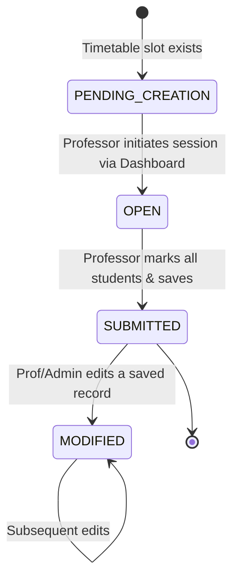
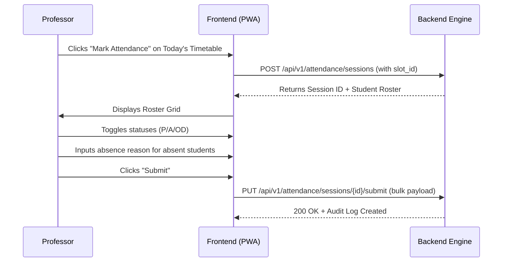

# CSE One - Volume 8
## Attendance Engine (Core Business Logic)

### 1. Attendance Engine Overview
The Attendance Engine is the operational heart of CSE One. Designed as a high-performance, timetable-driven, and highly auditable module, it guarantees that academic attendance is captured with absolute integrity. By removing manual class selection and enforcing session-based tracking, the engine eliminates human error. Every attendance record is immutably tied to an Attendance Session, and every modification generates a permanent audit trail, ensuring that the system meets stringent enterprise and academic compliance standards.

### 2. Attendance Session Architecture
The Attendance Session is the foundational aggregate root of the Attendance domain. An individual attendance record cannot exist outside a session.
- **Session ID:** UUIDv4 Primary Key.
- **Date & Day:** Localized date of the session.
- **Academic Context:** Year, Section, Subject.
- **Personnel Context:** Professor marking the attendance; Faculty Advisor (reference for notifications).
- **Time Context:** Period ID, Start Time, End Time.
- **State:** `OPEN` (Roster loaded, unmarked), `SUBMITTED` (First pass complete), `MODIFIED` (Altered post-submission).
- **Timetable Reference:** FK to `timetable_slot`.
- **Timestamps:** `created_at`, `updated_at`.

### 3. Attendance Lifecycle


### 4. Business Rules
- **No Manual Class Creation:** Attendance can only be marked against a valid `timetable_slot` for the current date.
- **Exhaustive Marking:** A session cannot transition to `SUBMITTED` until every student in the roster has a status (Present, Absent, or OD).
- **Absence Context:** If marked 'Absent', the system must flag whether the absence was prior-informed. If a `leave_request` exists and is `APPROVED` for that date, it pre-fills the context.
- **Retrospective Locking:** Attendance can be modified by the Professor up to 48 hours post-session. After 48 hours, only an Administrator can modify the record.

### 5. Validation Rules
- **Duplicate Prevention:** A `timetable_slot` ID + Date combination must be unique in the `attendance_session` table.
- **Roster Integrity:** Students loaded into the session must have a `section_id` matching the `timetable_slot`'s `section_id`.
- **Time Bounds:** A Professor cannot initiate a session for a period that hasn't started yet (e.g., cannot mark Period 5 during Period 1).

### 6. Attendance Status Model
| Status | UI Visual Standard | Description |
| :--- | :--- | :--- |
| **Present** | Solid Green (#16A34A) | Student physically attended the class. |
| **Absent** | Solid Red (#DC2626) | Student missed the class. Requires context (Reason/Prior Informed). |
| **OD** | Solid Amber (#D97706) | On Duty. Student is officially engaged elsewhere (e.g., Symposium). |
| *(Pending)* | Solid Gray (#94A3B8) | Intermediate state on the UI before the Professor clicks a status. |
| *(Modified)*| Soft Blue (#3B82F6) | Visual indicator on history screens that a record was changed post-submission. |

### 7. Professor Workflow


### 8. Student Workflow
- **Dashboard Synchronization:** The moment a session transitions to `SUBMITTED`, the student's dashboard recalculates.
- **Visibility:** Students see their daily attendance timeline (e.g., Period 1: P, Period 2: A).
- **History Tracking:** Students have dedicated tabs for Present History, Absent History (with reasons), and OD History.

### 9. Faculty Advisor Workflow
- **Cohort Monitoring:** FAs view a specialized dashboard showing today's absentees from their assigned 20-student cohort.
- **Prior-Informed Corroboration:** If a student was marked absent, the FA can cross-reference it against pending leave requests and instantly approve the leave, which updates the attendance analytics.
- **Low Attendance Alerts:** The engine pushes UI alerts to the FA for any student dipping below 75% overall attendance.

### 10. Admin Workflow
- **Department-Wide Oversight:** Admins view aggregations (Year-wise, Section-wise).
- **Override Authority:** Admins have the ability to override any attendance record at any time.
- **Audit Verification:** Admins can view the exact history of an attendance record (e.g., "Student was marked Absent by Prof. X, modified to Present by Prof. X 2 hours later").

### 11. API Specifications
- `POST /api/v1/attendance/sessions`: Initialize a session.
- `GET /api/v1/attendance/sessions/current`: Fetch the active session for the logged-in Professor.
- `PUT /api/v1/attendance/sessions/{id}`: Bulk upsert attendance records (save draft).
- `POST /api/v1/attendance/sessions/{id}/submit`: Lock session and finalize records.
- `PUT /api/v1/attendance/records/{id}`: Modify a specific student's record (generates modification audit).
- `GET /api/v1/attendance/analytics/student/{id}`: Retrieve percentage breakdowns.

### 12. Backend Service Design
- **AttendanceSessionService:** Manages the creation lifecycle. Ensures duplicate sessions aren't spawned for the same slot.
- **AttendanceRecordService:** Handles the bulk upsert logic. Implements `update_record` which strictly enforces the generation of an `AuditLog` entry.
- **AttendanceValidationService:** Intercepts requests to ensure the Professor owns the slot, the time bounds are legal, and the roster matches the DB.
- **AttendanceAnalyticsService:** Offloads heavy aggregation queries. Calculates cumulative percentages using optimized SQL views.

### 13. Frontend Attendance Page Specification
- **Layout:** Mobile-optimized, ultra-dense list view.
- **Student Row:** Register Number, Name, Photo Placeholder.
- **Quick Mark Actions:** Segmented control or large touch targets for [ P ] [ A ] [ OD ].
- **Absence Expansion:** Clicking [ A ] expands a small inline drawer to select "Prior Informed" and input "Reason".
- **Bulk Actions:** A "Mark All Unmarked as Present" button pinned to the bottom navigation bar to speed up processing for large classes.
- **Confirmation:** A bottom sheet summarizing totals (e.g., "55 Present, 3 Absent, 2 OD") before final submission.

### 14. Analytics Design
- **Overall %:** `(Total Present + Total OD) / Total Sessions Conducted * 100`.
- **Subject %:** Same formula, filtered by `subject_id`.
- **Heatmap:** A GitHub-style contribution graph on the Student profile showing daily attendance density (Green = All Present, Red = All Absent, Yellow = Mixed).
- **Professor Completion:** Tracks if a Professor missed marking attendance for a conducted slot.

### 15. Audit Logging
Every mutation to an `attendance_record` is intercepted.
- **Mechanism:** SQLAlchemy `after_update` event listener.
- **Payload Logged:**
  ```json
  {
    "action": "ATTENDANCE_MODIFIED",
    "entity_id": "record_uuid",
    "previous_state": {"status": "ABSENT", "reason": "Sick"},
    "new_state": {"status": "PRESENT", "reason": null},
    "modified_by": "professor_uuid",
    "timestamp": "2026-07-15T10:00:00Z"
  }
  ```

### 16. Performance Strategy
- **Bulk Operations:** Attendance submission uses PostgreSQL `executemany` or `INSERT ... ON CONFLICT DO UPDATE` to save 60 records in a single database roundtrip.
- **Denormalization (Optional):** If calculating overall percentage dynamically becomes too slow, a `cached_attendance_percentage` column on the `student` table can be updated asynchronously via a background task after every session submission.
- **Indexes:** B-Tree indexes on `attendance_record(session_id, student_id)` and `attendance_session(timetable_slot_id, date)`.

### 17. Testing Strategy
- **Unit Tests:** Mock DB dependencies to test `calculate_percentage` algorithms.
- **Integration Tests:** Execute the full lifecycle: `Create Session -> Submit Records -> Modify Record -> Assert Audit Log Creation`.
- **Validation Tests:** Force an API call with an invalid `timetable_slot_id` to assert a 403/400 response.
- **Performance Tests:** Load test the `bulk_upsert` endpoint with 100 concurrent professors submitting 60 records each simultaneously.

### 18. Attendance Engine Architecture Decision Record (ADR)
- **ADR-ATT-001: Session-Based Tracking over Flat Records:** Chosen because attendance is inherently grouped by an event (a class). A Session entity provides a natural anchor for metadata (Start Time, Professor, Slot) rather than duplicating this on every student's individual record.
- **ADR-ATT-002: Hard Audit Trail for Modifications:** Chosen to maintain academic integrity. Mistakes happen, so modification must be allowed, but an immutable ledger ensures transparency if disputes arise.
- **ADR-ATT-003: OD counts as Present in Denominator:** Based on standard academic policy, On Duty is treated positively in percentage calculations. The analytics engine is programmed to treat OD mathematically identical to Present, though it remains visually distinct in reports.
