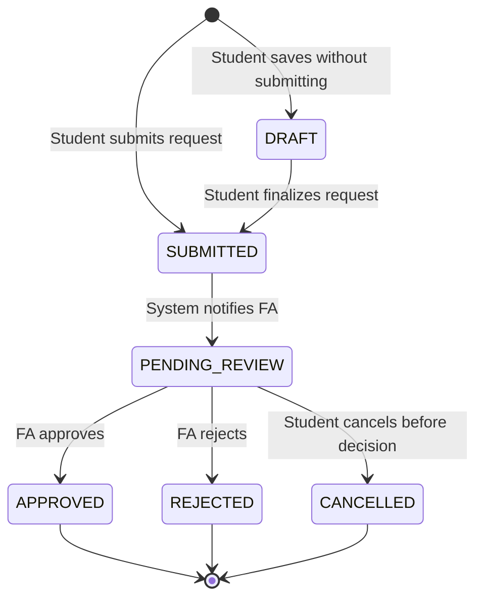
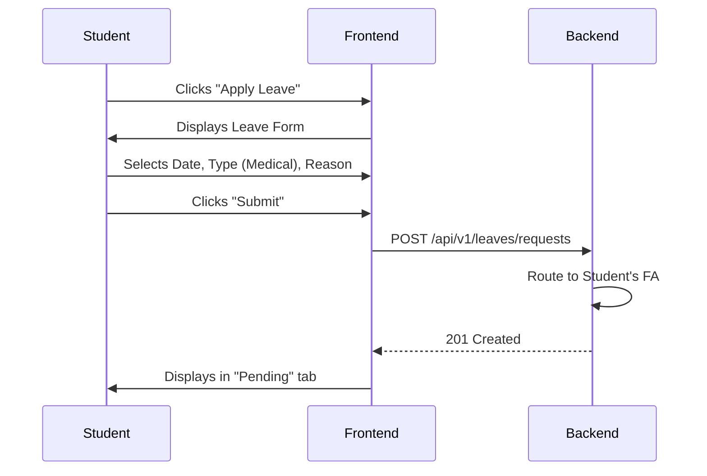
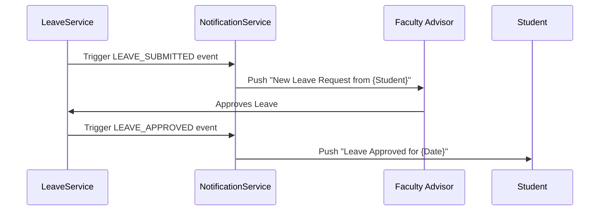

# CSE One - Volume 9
## Leave Management & Faculty Advisor Workflow

### 1. Module Overview
The Leave Management module is a critical operational component of CSE One, explicitly designed to formalize student absences. It operates through the structural hierarchy defined in Volume 7, routing all requests directly to a student's assigned Faculty Advisor. By deeply integrating with the Volume 8 Attendance Engine, it ensures that teaching Professors are instantly aware of pre-approved absences when marking attendance, reducing friction and maintaining strict academic discipline.

### 2. Faculty Advisor Model
The Faculty Advisor (FA) is a specialized Professor role tasked with pastoral and academic oversight of a specific cohort (typically 20 students).
- **Initial Assignment:** Administrators assign a block of students to an FA at the start of the academic year.
- **Reassignment:** If an FA leaves or changes roles, an Admin can execute a bulk transfer of their cohort to a new FA.
- **Historical Tracking:** `student_advisor_history` table tracks all FA assignments with `start_date` and `end_date` to ensure historical audits accurately reflect who approved a leave at a specific time.

### 3. Leave Lifecycle


### 4. Leave Status Model
| Status | UI Visual Standard | Description |
| :--- | :--- | :--- |
| **Draft** | Outline Gray | Saved locally but not yet routed to the FA. |
| **Pending** | Solid Amber (#D97706) | Submitted and awaiting FA review. |
| **Approved** | Solid Green (#16A34A) | FA has authorized the absence. Will reflect in Attendance. |
| **Rejected** | Solid Red (#DC2626) | FA has denied the request. |
| **Cancelled**| Solid Gray (#64748B) | Student withdrew the request before FA took action. |

### 5. Student Workflow


### 6. Faculty Advisor Workflow
- **Dashboard:** The FA sees a "Pending Approvals" widget immediately upon login.
- **Review:** Clicking a request shows the Student's past 30 days of attendance, previous leave history, and the current request details.
- **Action:** FA clicks "Approve" or "Reject", optionally attaching a decision remark (mandatory if rejected).
- **Analytics:** FA dashboard highlights any assigned student whose overall attendance drops below the 75% university threshold.

### 7. Professor Integration
- When a Professor initiates an **Attendance Session** (Volume 8), the engine cross-references the roster against `leave_request` where status is `APPROVED`.
- In the attendance grid, a student with an approved leave will have an indicator (e.g., a small "OD" or "Leave" badge next to their name).
- **Policy Enforcement:** The Professor still manually clicks 'Absent' or 'OD' based on physical presence, but the system auto-fills the "Prior Informed" flag and the reason based on the FA's approval.

### 8. Admin Workflow
- Admins possess a global view of all leave requests across the department.
- **Reporting:** Can generate monthly CSV exports of all Medical leaves, ODs, etc.
- **Category Management:** Admins can dynamically add/remove `leave_type` categories (e.g., adding "Hackathon" under OD).
- **Overrides:** Admins can override an FA's decision in exceptional cases (generates a specific Admin Override audit log).

### 9. API Specifications
- `POST /api/v1/leaves`: Create a new request (Draft/Submit).
- `GET /api/v1/leaves/me`: Get current student's leave history.
- `GET /api/v1/leaves/approvals`: Get pending requests for the logged-in Faculty Advisor.
- `PUT /api/v1/leaves/{id}/approve`: FA approves request.
- `PUT /api/v1/leaves/{id}/reject`: FA rejects request.
- `PUT /api/v1/leaves/{id}/cancel`: Student cancels pending request.

### 10. Backend Service Design
- **LeaveService:** Manages CRUD operations and enforces state machine transitions.
- **FacultyAdvisorService:** Resolves the FA mapping for a student to ensure requests are routed correctly.
- **LeaveValidationService:** Prevents overlapping leave requests (e.g., applying for Medical leave on a day already marked for OD).
- **LeaveNotificationService:** Triggers in-app alerts when statuses change.

### 11. Frontend Specifications
- **Leave Request Form:** Utilizes React Hook Form + Zod. Date pickers must block out dates in the past (unless backdated leave is explicitly enabled via config) and block out existing overlapping requests.
- **Status Chips:** Uniform `Badge` components from shadcn/ui matching the Status Model colors.
- **FA Review View:** A split-pane layout: Left pane shows pending list, Right pane shows deep context (Request details + Student Attendance Graph).

### 12. Notification Flow


### 13. Business Rules
- **Overlapping Leaves:** A student cannot have two active (Pending/Approved) leave requests for the same date.
- **Backdating:** Students can apply for leave up to 3 days in the past (e.g., sudden sickness). Beyond 3 days, it requires Admin intervention.
- **Immutability:** Once a decision (Approve/Reject) is made, the student cannot edit or cancel the request.
- **Cancellation:** A student can only cancel a `PENDING` or `DRAFT` request.

### 14. Analytics Design
- **Monthly Leave Trend:** Bar chart comparing Medical vs. Personal vs. OD leaves across the department.
- **Frequent Absentees:** Table highlighting students who have consumed more than `X` days of leave in a semester.
- **FA Workload:** Tracks average time taken by an FA to respond to a leave request (SLA monitoring).

### 15. Audit Logging
Every state transition on the `leave_request` table is logged in the centralized `audit_log` table.
- **Payload Logged:**
  ```json
  {
    "action": "LEAVE_APPROVED",
    "entity_id": "leave_uuid",
    "previous_state": "PENDING_REVIEW",
    "new_state": "APPROVED",
    "modified_by": "fa_uuid",
    "remarks": "Medical certificate verified.",
    "timestamp": "2026-07-15T14:30:00Z"
  }
  ```

### 16. Performance Strategy
- **Filtering & Pagination:** The Admin view uses cursor-based pagination to handle thousands of historical records efficiently.
- **Caching:** The FA's "Pending Approvals" count is cached in Redis to instantly render badges on the sidebar navigation.
- **Archiving:** At the end of an academic year, `APPROVED` and `REJECTED` leaves are moved to a cold storage partition or historical table to keep the active queries lightning fast.

### 17. Testing Strategy
- **Unit Tests:** Verify the Leave Status State Machine prevents invalid transitions (e.g., `APPROVED` -> `PENDING`).
- **Integration Tests:** Test the full flow: Student submits -> FA queries `/approvals` -> FA approves -> API returns 200 -> Audit log created.
- **Validation Tests:** Attempt to submit overlapping date ranges and verify a 400 Bad Request is returned.

### 18. Leave Management Architecture Decision Record (ADR)
- **ADR-LM-001: Separation of Leave from Attendance Records:** Chosen because a Leave Request is an intent, while an Attendance Record is physical reality. A student might have approved leave but show up anyway. Therefore, the Professor retains ultimate authority on the attendance grid, heavily guided by the Leave data.
- **ADR-LM-002: Hard-Coupling to Faculty Advisor:** Chosen over a generic "HOD Approval" flow to distribute administrative workload and ensure students are handled by the professor who knows them best.
- **ADR-LM-003: Soft Deletes for Cancellations:** When a student cancels a request, it transitions to `CANCELLED` rather than being deleted from the DB. This prevents gaps in the audit log and prevents abuse of the system.
